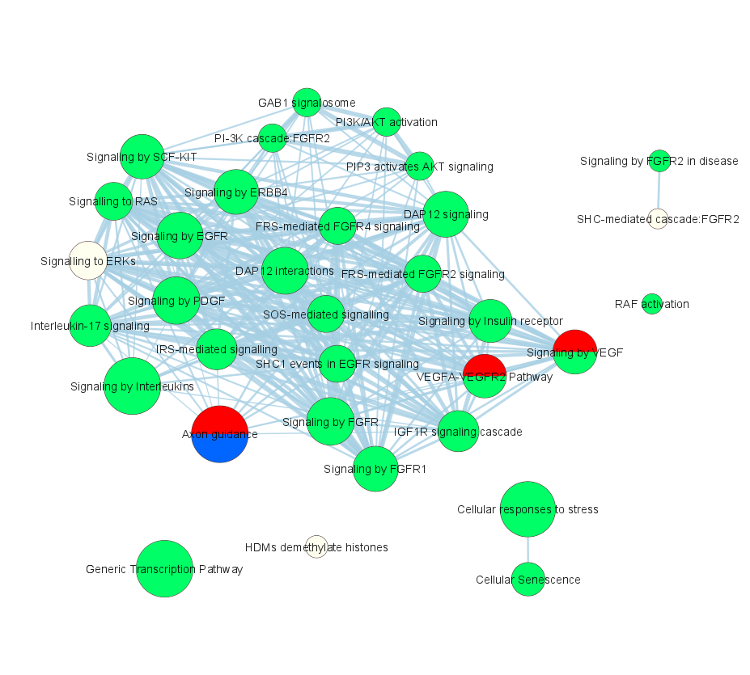

# ActivePathways - integrative pathway analysis of multi-omics data


**July 28th 2024: ActivePathways version 2.0.5 is now available on CRAN and GitHub that fixes a minor bug on exporing unfiltered results as CSV files. The major update 2.0 provides the directional p-value merging (DPM) method described in our recent publication.**

ActivePathways is a tool for multivariate pathway enrichment analysis that identifies gene sets, such as pathways or Gene Ontology terms, that are over-represented in a list or matrix of genes. ActivePathways uses a data fusion method to combine multiple omics datasets, prioritises genes based on the significance and direction of signals from the omics datasets, and performs pathway enrichment analysis of these prioritised genes. We can find pathways and genes supported by single or multiple omics datasets, as well as additional genes and pathways that are only apparent through data integration and remain undetected in any single dataset alone. 

The new version of ActivePathways is described in our recent publication.

Mykhaylo Slobodyanyuk^, Alexander T. Bahcheli^, Zoe P. Klein, Masroor Bayati, Lisa J. Strug, Jüri Reimand. Directional integration and pathway enrichment analysis for multi-omics data. *Nature Communications* 15, 5690 (2024). (^ - co-first authors)
<https://www.nature.com/articles/s41467-024-49986-4>
<https://pubmed.ncbi.nlm.nih.gov/38971800/>

The first version of ActivePathways was published in Nature Communications with the PCAWG Pan-Cancer project. 

Marta Paczkowska^, Jonathan Barenboim^, Nardnisa Sintupisut, Natalie S. Fox, Helen Zhu, Diala Abd-Rabbo, Miles W. Mee, Paul C. Boutros, PCAWG Drivers and Functional Interpretation Working Group, PCAWG Consortium, Juri Reimand. Integrative pathway enrichment analysis of multivariate omics data. *Nature Communications* 11, 735 (2020) (^ - co-first authors)
<https://www.nature.com/articles/s41467-019-13983-9> 
<https://pubmed.ncbi.nlm.nih.gov/32024846/>

The package version 2.0.3 used in the DPM preprint and manuscript is archived on Zenodo: <https://zenodo.org/records/12118089>.

## Installation

Package tested with: MacOS 14, Windows 11, Ubuntu 20.04.

Software dependencies: data.table, ggplot2, testthat, knitr, rmarkdown, RColorBrewer.

Installation time: less than 2 minutes.

#### From CRAN: ActivePathways 2.0.5 is currently the most recent version
Open R and run `install.packages('ActivePathways')`

#### Using devtools on our GitHub repository
Using the R package `devtools`, run
`devtools::install_github('https://github.com/reimandlab/ActivePathways', build_vignettes = TRUE)`

#### From source on our GitHub repository
Clone the repository, for example using `git clone https://github.com/reimandlab/ActivePathways.git`. 

Open R in the directory where you cloned the package and run `install.packages("ActivePathways", repos = NULL, type = "source")`


## Using ActivePathways

See the vignette for more details. Run `browseVignettes(package='ActivePathways')` in R.


### Examples

The simplest use of ActivePathways requires only a data table and a GMT file. The data table is a matrix of p-values of genes/transcripts/proteins as rows and omics datasets as columns. it also needs a list of gene sets in the form of a GMT [(Gene Matrix Transposed)](https://software.broadinstitute.org/cancer/software/gsea/wiki/index.php/Data_formats#GMT:_Gene_Matrix_Transposed_file_format_.28.2A.gmt.29) file. 

* The data table must be a numerical matrix. For a single gene list, a one-column matrix can be used. The matrix cannot contain any missing values, and one conservative option is to re-assign all missing values as 1s, indicating our confidence that the missing P-values are always insignificant. Alternatively, one may consider removing genes with NA values.

* Gene sets in the form of a GMT file can be acquired from multiple [sources](https://baderlab.org/GeneSets) such as Gene Ontology, Reactome and others. For better accuracy and statistical power these pathway databases should be combined. Acquiring an [up-to-date GMT file](http://download.baderlab.org/EM_Genesets/current_release/) is essential to avoid using unreliable outdated annotations [(see this paper)](https://www.nature.com/articles/nmeth.3963). 

```R

library(ActivePathways)

##
# Run an example using the data files included in the ActivePathways package. 
# This basic example does not incorporate directionality. 
##

fname_scores <- system.file("extdata", "Adenocarcinoma_scores_subset.tsv", 
		package = "ActivePathways")
fname_GMT <- system.file("extdata", "hsapiens_REAC_subset.gmt", 
		package = "ActivePathways")

##
# Numeric matrix of p-values is required as input. 
# NA values are converted to P = 1.
##

scores <- read.table(fname_scores, header = TRUE, row.names = 'Gene')
scores <- as.matrix(scores)
scores[is.na(scores)] <- 1


##
# Main call of ActivePathways function:
##

enriched_pathways <- ActivePathways(scores, fname_GMT) 

#35 terms were removed from gmt because they did not make the geneset_filter
#91 rows were removed from scores because they are not found in the background


##
# list a few first results of enriched pathways identified by ActivePathways
##

enriched_pathways[1:3,]

#        term_id         term_name adjusted_p_val term_size
#1: REAC:2424491   DAP12 signaling   4.491268e-05       358
#2:  REAC:422475     Axon guidance   2.028966e-02       555
#3:  REAC:177929 Signaling by EGFR   6.245734e-04       366
#                                   overlap       evidence
#1:     TP53,PIK3CA,KRAS,PTEN,BRAF,NRAS,...            CDS
#2: PIK3CA,KRAS,BRAF,NRAS,CALM2,RPS6KA3,... X3UTR,promCore
#3:     TP53,PIK3CA,KRAS,PTEN,BRAF,NRAS,...            CDS
#                            Genes_X3UTR Genes_X5UTR
#1:                                   NA          NA
#2: CALM2,ARPC2,RHOA,NUMB,CALM1,ACTB,...          NA
#3:                                   NA          NA
#                             Genes_CDS
#1: TP53,PTEN,KRAS,PIK3CA,BRAF,NRAS,...
#2:                                  NA
#3: TP53,PTEN,KRAS,PIK3CA,BRAF,NRAS,...
#                                Genes_promCore
#1:                                          NA
#2: EFNA1,IQGAP1,COL4A1,SCN2B,RPS6KA3,CALM2,...
#3:                                          NA

##
# Show enriched genes of the first pathway 'DAP12 signalling' 
# the column `overlap` displays genes of the integrated dataset (from 
# data fusion, i.e., p-value merging) that occur in the given pathway.
# Genes are ranked by joint significance across input omics datasets.
##

enriched_pathways[["overlap"]][[1]]
# [1] "TP53"   "PIK3CA" "KRAS"   "PTEN"   "BRAF"   "NRAS"   "B2M"    "CALM2"
# [9] "CDKN1A" "CDKN1B"

##
# Save the resulting pathways as a Comma-Separated Values (CSV) file
# for spreadsheets and computational pipelines.
# the data.table object cannot be saved directly as text.
##

export_as_CSV(enriched_pathways, "enriched_pathways.csv")


## 
# Examine a few lines of the two major types of input
##

##
# The scores matrix includes p-values for genes (rows) 
#   and evidence of different omics datasets (columns).
# This dataset includes predicted cancer driver mutations
#   in gene coding/CDS, 5'UTR, 3'UTR, and core promoter sequences
##

head(scores, n = 3)

#         X3UTR      X5UTR       CDS  promCore
#A2M  1.0000000 0.33396764 0.9051708 0.4499201
#AAAS 1.0000000 0.42506012 0.7047723 0.7257641
#ABAT 0.9664126 0.04202735 0.7600985 0.1903789

##
# GMT files include functional gene sets (pathways, processes).
# Each tab-separated line represents a gene set: 
#   gene set ID, description followed by gene symbols.
# Gene symbols in the scores table and the GMT file need to match. 
# NB: this GMT file is a small subset of the real GMT file built for testing. 
#     It should not be used for real analyses. 
##

readLines(fname_GMT)[11:13]

#[1] "REAC:3656535\tTGFBR1 LBD Mutants in Cancer\tTGFB1\tFKBP1A\tTGFBR2\tTGFBR1\t"
#[2] "REAC:73927\tDepurination\tOGG1\tMPG\tMUTYH\t"
#[3] "REAC:5602410\tTLR3 deficiency - HSE\tTLR3\t" 


```

### Examples - Directional integration of multi-omics data

ActivePathways 2.0 extends our integrative pathway analysis framework significantly. Users can now provide directional assumptions of input omics datasets for more accurate analyses. This allows us to prioritise genes and pathways where certain directional assumptions are met, and penalise those where the assumptions are violated. 

For example, fold-change in protein expression would be expected to associate positively with mRNA fold-change of the corresponding gene, while negative associations would be unexpected and indicate more-complex situations or potential false positives. We can instruct the pathway analysis to prioritise positively-associated protein/mRNA pairs and penalise negative associations (or vice versa). 

Two additional inputs are included in ActivePathways that allow diverse multi-omics analyses. These inputs are optional. 

The scores_direction and constraints_vector parameters are provided in the merge_p_values() and ActivePathways() functions to incorporate this directional penalty into the data fusion and pathway enrichment analyses. 

The parameter constraints_vector is a vector that allows the user to represent the expected relationship between the input omics datasets. The vector size is n_datasets. Values include +1, -1, and 0. The constraints_vector should reflect the expected *relative* directional relationship between datasets. For example, the constraints_vector values c(-1,1) and c(1,-1) are functionally identical. When combining datasets that contain both directional datatypes (eg gene or protein expression, gene promoter methylation) and non-directional datatypes (eg gene mutational burden, ChIP-seq), we can define the relative relationship between directional datatypes with the values 1 and -1 while setting the value of non-directional datatypes to 0.

The parameter scores_direction is a matrix that reflects the directions that the genes/transcripts/protein show in the data. The matrix size is n_genes * n_datasets, that is the same size as the P-value matrix. This is a numeric matrix, but only the signs of the values are accounted for. 

#### Directional data integration at the gene level

```R 

##
# load a dataset of P-values and fold-changes for mRNA and protein levels
# this dataset is embedded in the package
##
fname_data_matrix <- system.file('extdata', 
		'Differential_expression_rna_protein.tsv',
		package = 'ActivePathways')
pvals_FCs <- read.table(fname_data_matrix, header = TRUE, sep = '\t')
                 
# examine a few example genes
example_genes <- c('ACTN4','PIK3R4','PPIL1','NELFE','LUZP1','ITGB2')
pvals_FCs[pvals_FCs$gene %in% example_genes,]

#       gene     rna_pval rna_log2fc protein_pval protein_log2fc
#73   PIK3R4 1.266285e-03  1.1557077 2.791135e-03     -0.8344799
#74    PPIL1 1.276838e-03 -1.1694221 1.199303e-04     -1.1193605
#606   NELFE 1.447553e-02 -0.9120687 1.615592e-05     -1.2630114
#4048  LUZP1 3.253382e-05  1.5830796 4.129125e-02      0.5791377
#4050  ITGB2 4.584450e-05  1.6472117 1.327997e-01      0.4221579
#4052  ACTN4 5.725503e-05  1.5531533 8.238317e-07      1.4279158

##
# create a matrix of gene/protein P-values. 
# where the columns are different omics datasets (mRNA, protein)
# and the rows are genes. 
##

pval_matrix <- data.frame(
		row.names = pvals_FCs$gene, 
		rna = pvals_FCs$rna_pval, 
		protein = pvals_FCs$protein_pval)
pval_matrix <- as.matrix(pval_matrix)

##
# examine a few genes in the P-value matrix
##

pval_matrix[example_genes,]
#                rna      protein
#ACTN4  5.725503e-05 8.238317e-07
#PIK3R4 1.266285e-03 2.791135e-03
#PPIL1  1.276838e-03 1.199303e-04
#NELFE  1.447553e-02 1.615592e-05
#LUZP1  3.253382e-05 4.129125e-02
#ITGB2  4.584450e-05 1.327997e-01

##
# convert missing values to P = 1
##

pval_matrix[is.na(pval_matrix)] <- 1

##
# Create a matrix of gene/protein directions 
# similarly to the P-value matrix (i.e., scores_direction)
##

dir_matrix <- data.frame(
		row.names = pvals_FCs$gene, 
		rna = pvals_FCs$rna_log2fc, 
		protein = pvals_FCs$protein_log2fc)
dir_matrix <- as.matrix(dir_matrix)

##
# ActivePathways only uses the signs of the direction values (ie +1 or -1).
##

dir_matrix <- sign(dir_matrix)

##
# if directions are missing (NA), we recommend setting the values to zero 
##

dir_matrix[is.na(dir_matrix)] <- 0

##
# examine a few genes in the direction matrix
##

dir_matrix[example_genes,]
#       rna protein
#ACTN4    1       1
#PIK3R4   1      -1
#PPIL1   -1      -1
#NELFE   -1      -1
#LUZP1    1       1
#ITGB2    1       1

##
# This matrix has to be accompanied by a vector that 
# provides the expected relationship between the
# different datasets. Here, mRNA levels and protein 
# levels are expected to have consistent directions:
# either both positive or both negative (eg log fold-change).  
##

constraints_vector <- c(1,1)

##
# Alternatively, we can use another vector to prioritise 
# genes/proteins where the directions are the opposite.
##

# constraints_vector <- c(1,-1)

##
# Now we merge the P-values of the two datasets 
# using directional assumtions and compare these 
# with the plain non-directional merging. 
# The top 5 scoring genes differ if we penalise genes
# where this directional logic is violated: 
# While 4 of 5 genes retain significance, the gene PIK3R4 is penalised. 
# Interestingly, as a consequence of penalising PIK3R4, 
# other genes such as ITGB2 move up in rank.  
##

directional_merged_pvals <- merge_p_values(pval_matrix, 
		method = "DPM", dir_matrix, constraints_vector)

merged_pvals <- merge_p_values(pval_matrix, method = "Brown")


sort(merged_pvals)[1:5]
#       ACTN4        PPIL1        NELFE        LUZP1       PIK3R4 
#1.168708e-09 2.556067e-06 3.804646e-06 1.950607e-05 4.790125e-05 


sort(directional_merged_pvals)[1:5]
#       ACTN4        PPIL1        NELFE        LUZP1        ITGB2 
#1.168708e-09 2.556067e-06 3.804646e-06 1.950607e-05 7.920157e-05 

##
# PIK3R4 is penalised because the fold-changes of its mRNA and 
# protein levels are significant and have the opposite signs:
##

pvals_FCs[pvals_FCs$gene == "PIK3R4",]
#     gene    rna_pval rna_log2fc protein_pval protein_log2fc
#73 PIK3R4 0.001266285   1.155708  0.002791135     -0.8344799

pval_matrix["PIK3R4",]
#        rna     protein
#0.001266285 0.002791135

dir_matrix["PIK3R4",]
#    rna protein
#      1      -1

merged_pvals["PIK3R4"]
#      PIK3R4
#4.790125e-05

directional_merged_pvals["PIK3R4"]
#   PIK3R4
#0.8122527

```
To assess the impact of the directional penalty on gene merged P-value signals we create a plot showing directional results on the y axis and non-directional results on the x. Blue dots are prioritised hits, red dots are penalised.

```R
lineplot_df <- data.frame(original = -log10(merged_pvals),
			  modified = -log10(directional_merged_pvals))

ggplot(lineplot_df) +
	geom_point(size = 2.4, shape = 19,
		aes(original, modified,
		    color = ifelse(original <= -log10(0.05),"gray",
                                    ifelse(modified > -log10(0.05),"#1F449C","#F05039")))) +
	labs(title = "",
		 x ="Merged -log10(P)",
		 y = "Directional Merged -log10(P)") + 
            geom_hline(yintercept = 1.301, linetype = "dashed",
		       col = 'black', size = 0.5) +
            geom_vline(xintercept = 1.301, linetype = "dashed",
		       col = "black", size = 0.5) + 
            geom_abline(size = 0.5, slope = 1,intercept = 0) +
	    scale_color_identity()
	    
```


#### Pathway-level insight
To explore how changes on the individual gene level impact biological pathways, we can compare results before and after incorporating a directional penalty.

```R 

##
# use the example GMT file embedded in the package
##

fname_GMT2 <- system.file("extdata", "hsapiens_REAC_subset2.gmt", 
		package = "ActivePathways")
##
# Integrative pathway enrichment analysis with no directionality
##
enriched_pathways <- ActivePathways(
		pval_matrix, gmt = fname_GMT2, cytoscape_file_tag = "Original_")

##
# Directional integration and pathway enrichment analysis
# this analysis the directional coefficients and constraints_vector from 
# the gene-based analysis described above
##

constraints_vector
# [1] 1 1

dir_matrix[example_genes,]
#       rna protein
#ACTN4    1       1
#PIK3R4   1      -1
#PPIL1   -1      -1
#NELFE   -1      -1
#LUZP1    1       1
#ITGB2    1       1

enriched_pathways_directional <- ActivePathways(
		pval_matrix, gmt = fname_GMT2, cytoscape_file_tag = "Directional_",
		merge_method = "DPM", scores_direction = dir_matrix, constraints_vector = constraints_vector)
		
## 
# Examine the pathways that are lost when 
# directional information is incorporated in the data integration
## 

pathways_lost_in_directional_integration = 
		setdiff(enriched_pathways$term_id, enriched_pathways_directional$term_id)
pathways_lost_in_directional_integration
#[1] "REAC:R-HSA-3858494" "REAC:R-HSA-69206"   "REAC:R-HSA-69242"
#[4] "REAC:R-HSA-9013149"

enriched_pathways[enriched_pathways$term_id %in% pathways_lost_in_directional_integration,] 
#              term_id                              term_name adjusted_p_val
#1: REAC:R-HSA-3858494 Beta-catenin independent WNT signaling    0.013437464
#2:   REAC:R-HSA-69206                        G1/S Transition    0.026263457
#3:   REAC:R-HSA-69242                                S Phase    0.009478766
#4: REAC:R-HSA-9013149                      RAC1 GTPase cycle    0.047568911
#   term_size                                  overlap    evidence
#1:       143 PSMA5,PSMB4,PSMC5,PSMD11,PSMA8,GNG13,... rna,protein
#2:       130  PSMA5,PSMB4,CDK4,PSMC5,PSMD11,CCNB1,...     protein
#3:       162   PSMA5,PSMB4,RFC3,CDK4,PSMC5,PSMD11,...    combined
#4:       184 SRGAP1,TIAM1,BAIAP2,FMNL1,DOCK9,PAK3,...         rna
#                                      Genes_rna
#1:       GNG13,PSMC1,PSMA5,PSMB4,ITPR3,DVL1,...
#2:                                           NA
#3:                                           NA
#4: SRGAP1,TIAM1,FMNL1,ARHGAP30,FARP2,DOCK10,...
#                               Genes_protein
#1: PSMA8,PSMD11,PSMA5,PRKG1,PSMD10,PSMB4,...
#2:   PSMD11,PSMA5,PSMD10,PSMB4,CDK7,ORC2,...
#3:                                        NA
#4:                                        NA


##
# An example of a lost pathway is Beta-catenin independent WNT signaling. 
# Out of the 32 genes that contribute to this pathway enrichment, 
# 10 genes are in directional conflict. The enrichment is no longer 
# identified when these genes are penalised due to the conflicting 
# log2 fold-change directions.
##

wnt_pathway_id <- "REAC:R-HSA-3858494"
enriched_pathway_genes <- unlist(
		enriched_pathways[enriched_pathways$term_id == wnt_pathway_id,]$overlap)
enriched_pathway_genes
# [1] "PSMA5"  "PSMB4"  "PSMC5"  "PSMD11" "PSMA8"  "GNG13"  "SMURF1" "PSMC1"
# [9] "PSMA4"  "PLCB2"  "PRKG1"  "PSMD4"  "PSMD1"  "PSMD10" "PSMA6"  "PSMA2"
#[17] "PSMA1"  "PRKCA"  "PSMC6"  "RHOA"   "PSMB3"  "PSMB1"  "PSME3"  "ITPR3"
#[25] "AGO4"   "DVL3"   "PSMA3"  "PPP3R1" "DVL1"   "CLTA"   "PSME2"  "CALM1"
#[33] "PSMD6"  "PSMB6"

##
# examine the pathway genes that have directional disagreement and 
# contribute to the lack of pathway enrichment in the directional analysis
##

pathway_gene_pvals = pval_matrix[enriched_pathway_genes,]
pathway_gene_directions = dir_matrix[enriched_pathway_genes,]

directional_conflict_genes = names(which(
		pathway_gene_directions[,1] != pathway_gene_directions[,2] &
		pathway_gene_directions[,1] != 0 & pathway_gene_directions[,2] != 0))

pathway_gene_pvals[directional_conflict_genes,]
#              rna     protein
#PSMD11 0.34121101 0.002094310
#PSMA8  0.55510836 0.001415197
#SMURF1 0.03353629 0.042995333
#PSMD1  0.04650877 0.100178048
#RHOA   0.01786687 0.474628084
#PSME3  0.07148904 0.130184883
#ITPR3  0.01660850 0.589929787
#DVL3   0.46381447 0.022535743
#PSME2  0.03274707 0.514351089
#PSMB6  0.02863259 0.677224905

pathway_gene_directions[directional_conflict_genes,]
#       rna protein
#PSMD11   1      -1
#PSMA8    1      -1
#SMURF1   1      -1
#PSMD1    1      -1
#RHOA    -1       1
#PSME3    1      -1
#ITPR3    1      -1
#DVL3     1      -1
#PSME2   -1       1
#PSMB6   -1       1

length(directional_conflict_genes)
#[1] 10


```
To visualise differences in biological pathways between ActivePathways analyses with or without a directional penalty, we combine both outputs into a single enrichment map for [plotting](#visualising-directional-impact-with-node-borders).

More thorough documentation of the ActivePathways function can be found in R with `?ActivePathways`, and complete tutorials can be found with `browseVignettes(package='ActivePathways')`.


# Visualising pathway enrichment results using enrichment maps in Cytoscape

Cytoscape provides powerful tools to visualise the enriched pathways from `ActivePathways` as a network (i.e., an enrichment map). `ActivePathways` provides the files needed for building enrichment maps in Cytoscape. To create these files, supply a file prefix to the argument `cytoscape_file_tag` in the ActivePathways() function. The prefix can be a path to an existing writable directory.
 
```{r}
res <- ActivePathways(scores, fname_GMT, cytoscape_file_tag = "enrichmentMap__")
```
Four files are written using the prefix:

* `enrichmentMap__pathways.txt`: a table of significant terms and the associated adjusted P-values. Terms include molecular pathways, biological processes, and other gene sets. Note that only terms with `adjusted_p_val <= significant` are written.

* `enrichmentMap__subgroups.txt`: a matrix indicating which columns of the input matrix (i.e., which omics datasets) contributed to the discovery of each pathway. These values correspond to the `evidence` evaluation of input omics datasets discussed above. A value of one indicates the pathway was also detectable using a specific input omics dataset. A value of zero indicates otherwise. This file will be not generated if the input matrix is a single-column matrix of scores (just one omics dataset).

* `enrichmentMap__pathways.gmt`: a shortened version of the supplied GMT file, containing only the significant pathways detected by `ActivePathways`. 

* `enrichmentMap__legend.pdf`: a pdf file containing a legend, with colors corresponding to the different omics datasets visualised in the enrichment map. This can be used as a reference to the generated enrichment map.

## Creating enrichment maps using results of ActivePathways 

Pathway enrichment analysis often leads to complex and redundant results. Enrichment maps are network-based visualisations of pathway enrichment analyses. Enrichment maps can be generated in the Cytoscape software using the EnrichmentMap app. **The enhancedGraphics app is also required**. See the vignette for details: `browseVignettes(package='ActivePathways')`.


## Required software

1.	Cytoscape, see <https://cytoscape.org/download.html>
2.	EnrichmentMap app of Cytoscape, see menu Apps>App manager or <https://apps.cytoscape.org/apps/enrichmentmap> 
3.	EnhancedGraphics app of Cytoscape, see menu Apps>App manager or <https://apps.cytoscape.org/apps/enhancedGraphics> 

## Creating the enrichment map

* Open the Cytoscape software. 
* Select *Apps -> EnrichmentMap*. 
* In the following dialogue, click the button `+` *Add Data Set from Files* in the top left corner of the dialogue.
* Change the Analysis Type to Generic/gProfiler/Enrichr.
* Upload the files `enrichmentMap__pathways.txt` and `enrichmentMap__pathways.gmt` in the *Enrichments* and *GMT* fields, respectively. 
* Click the checkbox *Show Advanced Options* and set *Cutoff* to 0.6.
* Then click *Build* in the bottom-right corner to create the enrichment map. 


## Colour the nodes of the network to visualise supporting omics datasets

The third file `enrichmentMap__subgroups.txt` needs to be imported to Cytoscape directly in order to color nodes (i.e. terms) according to their source omics datasets. To import the file, select the menu option *File -> Import -> Table from File* and select the file `enrichmentMap__subgroups.txt`. In the following dialogue, select *To a Network Collection* in the dropdown menu *Where to Import Table Data*. Click OK to proceed. 


Cytoscape uses the imported information to color nodes like a pie chart. To enable this click the Style tab in the left control panel and select the Image/Chart1 Property in a series of dropdown menus (*Properties -> Paint -> Custom Paint 1 -> Image/Chart 1*). 


The *Image/Chart 1* property now appears in the Style control panel. Click the triangle on the right, then set the *Column* to *instruct* and the *Mapping Type* to *Passthrough Mapping*. 


This step colours the nodes corresponding to the enriched pathways according to the supporting omics datasets, based on the scores matrix initially analysed in `ActivePathways`. 



`ActivePathways` generates a color legend in the file `enrichmentMap__legend.pdf` that shows which colors correspond to which omics datasets. 


Note that one of the colors corresponds to a subset of enriched pathways with *combined* evidence. These terms were only detected through data fusion and P-value merging, and not with any of the input datasets individually. This exemplifies the added value of integrative multi-omics pathway enrichment analysis. 

## Visualising directional impact with node borders

From the drop-down Properties menu, select *Border Line Type*.


Set *Column* to *directional impact* and *Mapping Type* to *Discrete Mapping*. Now we can compare findings between a non-directional and a directional method. We highlight pathways that were shared (0), lost (1), and gained (2) between the approaches. Here, we have solid lines for the shared pathways, dots for the lost pathways, and vertical lines for the gained pathways. Border widths can be adjusted in the *Border Width* property, again with discrete mapping.


This step changes node borders in the aggregated enrichment map, depicting the additional information provided by directional impact.


## Alternative node coloring

For a more diverse range of colors, ActivePathways supports any color palette from RColorBrewer. The color_palette parameter must be provided.
```{r}
res <- ActivePathways(scores, gmt_file,
		      cytoscape_file_tag = "enrichmentMap__",
		      color_palette = "Pastel1")
```


Alternatively, the custom_colors parameter can be specified as a vector to manually input the color of each dataset. This vector should contain the same number of colors as columns in the scores matrix.
```{r}
res <- ActivePathways(scores, gmt_file,
		      cytoscape_file_tag = "enrichmentMap__",
		      custom_colors = c("violet","green","orange","red"))
```


To change the color of the *combined* contribution, a color must be provided to the color_integrated_only parameter.

**If the coloring of nodes did not work in Cytoscape after setting the options in the Style panel, check that the EnhancedGraphics Cytoscape app is installed.**

## References

* See the vignette for more details: `browseVignettes(package='ActivePathways')`.

* Mykhaylo Slobodyanyuk^, Alexander T. Bahcheli^, Zoe P. Klein, Masroor Bayati, Lisa J. Strug, Jüri Reimand. Directional integration and pathway enrichment analysis for multi-omics data. Nature Communications (2024) (^ - co-first authors) <https://www.nature.com/articles/s41467-024-49986-4> <https://pubmed.ncbi.nlm.nih.gov/38971800/>.

* Integrative Pathway Enrichment Analysis of Multivariate Omics Data. Paczkowska M^, Barenboim J^, Sintupisut N, Fox NS, Zhu H, Abd-Rabbo D, Mee MW, Boutros PC, PCAWG Drivers and Functional Interpretation Working Group; Reimand J, PCAWG Consortium. Nature Communications (2020) (^ - co-first authors) <https://pubmed.ncbi.nlm.nih.gov/32024846/> <https://doi.org/10.1038/s41467-019-13983-9>.

* Pathway Enrichment Analysis and Visualization of Omics Data Using g:Profiler, GSEA, Cytoscape and EnrichmentMap. Reimand J^, Isserlin R^, Voisin V, Kucera M, Tannus-Lopes C, Rostamianfar A, Wadi L, Meyer M, Wong J, Xu C, Merico D, Bader GD. Nature Protocols (2019) (^ - co-first authors)
<https://pubmed.ncbi.nlm.nih.gov/30664679/> <https://doi.org/10.1038/s41596-018-0103-9>.
