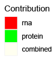

```{r, echo=FALSE}
knitr::opts_chunk$set(warning=FALSE, 
                      message=FALSE, 
                      width=500)
options(max.print=35)
library("ggplot2")
library("data.table")
```

# Multi-omics pathway enrichment analysis

## Introduction

ActivePathways is a tool for multivariate pathway enrichment analysis that identifies gene sets, such as pathways or Gene Ontology terms, that are over-represented in a list or matrix of genes. ActivePathways uses a data fusion method to combine multiple omics datasets, prioritizes genes based on the significance and direction of signals from the omics datasets, and performs pathway enrichment analysis of these prioritized genes. We can find pathways and genes supported by single or multiple omics datasets, as well as additional genes and pathways that are only apparent through data integration and remain undetected in any single dataset alone.

The new version of ActivePathways is described in our recent publication in Nature Communications (2024). 

Mykhaylo Slobodyanyuk^, Alexander T. Bahcheli^, Zoe P. Klein, Masroor Bayati, Lisa J. Strug, Jüri Reimand. Directional integration and pathway enrichment analysis for multi-omics data. Nature Communications (2024) (^ - co-first authors) <https://www.nature.com/articles/s41467-024-49986-4> <https://pubmed.ncbi.nlm.nih.gov/38971800/> 

The first version of ActivePathways was published in Nature Communications with the PCAWG Pan-Cancer project.

Marta Paczkowska\^, Jonathan Barenboim\^, Nardnisa Sintupisut, Natalie S. Fox, Helen Zhu, Diala Abd-Rabbo, Miles W. Mee, Paul C. Boutros, PCAWG Drivers and Functional Interpretation Working Group, PCAWG Consortium, Juri Reimand. Integrative pathway enrichment analysis of multivariate omics data. Nature Communications 11 735 (2020) (\^ - co-first authors) <https://www.nature.com/articles/s41467-019-13983-9> <https://pubmed.ncbi.nlm.nih.gov/32024846/>

## Pathway enrichment analysis using the ranked hypergeometric test

From a matrix of p-values, `ActivePathways` creates a ranked gene list where genes are prioritised based on their combined significance. The combined significance of each gene is determined by performing statistical data fusion on a series of omics datasets provided in the input matrix. The ranked gene list includes the most significant genes first. `ActivePathways` then performs a ranked hypergeometric test to determine if a pathway (i.e., a gene set with a common functional annotation) is enriched in the ranked gene list, by performing a series of hypergeometric tests (also known as Fisher's exact tests). In each such test, a larger set of genes from the top of the ranked gene list is considered. At the end of the series, the ranked hypergeometric test returns the top, most significant p-value from the series, corresponding to the point in the ranked gene list where the pathway enrichment reached the greatest significance of enrichment. This approach is useful when the genes in our ranked gene list have varying signals of biological importance in the input omics datasets, as the test identifies the top subset of genes that are the most relevant to the enrichment of the pathway.

## Using the package

A basic example of using ActivePathways is shown below.

We will analyse cancer driver gene predictions for a collection of cancer genomes. Each dataset (i.e., column in the matrix) contains a statistical significance score (P-value) where genes with small P-values are considered stronger candidates of cancer drivers based on the distribution of mutations in the genes. For each gene (i.e., row in the matrix), we have several predictions representing genomic elements of the gene, such as coding sequences (CDS), untranslated regions (UTR), and core promoters (promCore).

To analyse these driver genes using existing knowledge of gene function, we will use gene sets corresponding to known molecular pathways from the Reactome database. These gene sets are commonly distributed in text files in the GMT format [(Gene Matrix Transposed)](https://software.broadinstitute.org/cancer/software/gsea/wiki/index.php/Data_formats#GMT:_Gene_Matrix_Transposed_file_format_.28.2A.gmt.29) file.

Let's start by reading the data from the files embedded in the R package. For the p-value matrix, `ActivePathways` expects an object of the matrix class so the table has to be cast to the correct class after reading the file.

```{r}
scores <- read.table(
system.file('extdata', 'Adenocarcinoma_scores_subset.tsv', package = 'ActivePathways'), 
header = TRUE, sep = '\t', row.names = 'Gene')
scores <- as.matrix(scores)
scores
```

`ActivePathways` does not allow missing (NA) values in the matrix of P-values and these need to be removed. One conservative option is to re-assign all missing values as ones, indicating our confidence that the missing values are not indicative of cancer drivers. Alternatively, one may consider removing genes with NA values.

```{r}
scores[is.na(scores)] <- 1
```

## Basic use

The basic use of `ActivePathways` requires only two input parameters, the matrix of P-values with genes in rows and datasets in columns, as prepared above, and the path to the GMT file in the file system. Importantly, the gene IDs (symbols, accession numbers, etc) in the P-value matrix need to match those in the GMT file.

Here we use a GMT file provided with the package. This GMT file is heavily filtered and outdated; thus users must provide their own GMT file when using the package. These GMT files can be acquired from multiple [sources](https://baderlab.org/GeneSets) such as Gene Ontology, Reactome and others. For better accuracy and statistical power these pathway databases should be combined. Acquiring an [up-to-date GMT file](http://download.baderlab.org/EM_Genesets/current_release/) is essential to avoid using unreliable outdated annotations [(see this paper)](https://www.nature.com/articles/nmeth.3963).

```{r}
library(ActivePathways)
gmt_file <- system.file('extdata', 'hsapiens_REAC_subset.gmt', package = 'ActivePathways')
ActivePathways(scores, gmt_file)
```

## ActivePathways 2.0 Directional integration of multi-omics data

ActivePathways 2.0 extends our integrative pathway analysis framework significantly. Users can now provide directional assumptions of input omics datasets for more accurate analyses. This allows us to prioritise genes and pathways where certain directional assumptions are met and penalise those where the assumptions are violated.

For example, fold-change in protein expression would be expected to associate positively with mRNA fold-change of the corresponding gene, while negative associations would be unexpected and indicate more-complex situations or potential false positives. We can instruct the pathway analysis to prioritise positively-associated protein/mRNA pairs and penalise negative associations (or vice versa).

Two additional inputs are included in ActivePathways that allow diverse multi-omics analyses. These inputs are optional.

The scores_direction and constraints_vector parameters are provided in the merge_p_values() and ActivePathways() functions to incorporate this directional penalty into the data fusion and pathway enrichment analyses.

The parameter constraints_vector is a vector that allows the user to represent the expected relationship between the input omics datasets. The vector size is n_datasets. Values include +1, -1, and 0.

The parameter scores_direction is a matrix that reflects the directions that the genes/transcripts/protein show in the data. The matrix size is n_genes \* n_datasets, that is the same size as the P-value matrix. This is a numeric matrix, but only the signs of the values are accounted for.

### Directional data integration at the gene level

Load a dataset of P-values and fold-changes for mRNA and protein levels. This dataset is embedded in the package. Examine a few example genes.

```{r}
fname_data_matrix <- system.file('extdata', 
		'Differential_expression_rna_protein.tsv',
		package = 'ActivePathways')

pvals_FCs <- read.table(fname_data_matrix, header = TRUE, sep = '\t')

example_genes <- c('ACTN4','PIK3R4','PPIL1','NELFE','LUZP1','ITGB2')
pvals_FCs[pvals_FCs$gene %in% example_genes,]
```

Create a matrix of gene/protein P-values. Where the columns are different omics datasets (mRNA, protein) and the rows are genes. Examine a few genes in the P-value matrix, and convert missing values to P = 1.

```{r}
pval_matrix <- data.frame(
		row.names = pvals_FCs$gene, 
		rna = pvals_FCs$rna_pval, 
		protein = pvals_FCs$protein_pval)

pval_matrix <- as.matrix(pval_matrix)
pval_matrix[is.na(pval_matrix)] <- 1

pval_matrix[example_genes,]
```

Create a matrix of gene/protein directions similarly to the P-value matrix (i.e., scores_direction). ActivePathways only uses the signs of the direction values (ie +1 or -1). If directions are missing (NA), we recommend setting the values to zero. Lets examine a few genes in the direction matrix.

```{r}
dir_matrix <- data.frame(
		row.names = pvals_FCs$gene, 
		rna = pvals_FCs$rna_log2fc, 
		protein = pvals_FCs$protein_log2fc)

dir_matrix <- as.matrix(dir_matrix)
dir_matrix <- sign(dir_matrix)
dir_matrix[is.na(dir_matrix)] <- 0

dir_matrix[example_genes,]
```

This matrix has to be accompanied by a vector that provides the expected relationship between the different datasets. Here, mRNA levels and protein levels are expected to have consistent directions: either both positive or both negative (eg log fold-change). Alternatively, we can use another vector to prioritise genes/proteins where the directions are the opposite.

```{r}
constraints_vector <- c(1,1)
constraints_vector

# constraints_vector <- c(1,-1)
```

Now we merge the P-values of the two datasets using directional assumptions and compare these with the plain non-directional merging. The top 5 scoring genes differ if we penalise genes where this directional logic is violated: While 4 of 5 genes retain significance, the gene PIK3R4 is penalised. Interestingly, as a consequence of penalizing PIK3R4, other genes such as ITGB2 move up in rank.

```{r}
directional_merged_pvals <- merge_p_values(pval_matrix, 
		method = "DPM", dir_matrix, constraints_vector)

merged_pvals <- merge_p_values(pval_matrix, method = "Brown")

sort(merged_pvals)[1:5]
sort(directional_merged_pvals)[1:5]
```

PIK3R4 is penalised because the fold-changes of its mRNA and protein levels are significant and have the opposite signs:

```{r}
pvals_FCs[pvals_FCs$gene == "PIK3R4",]

pval_matrix["PIK3R4",]
dir_matrix["PIK3R4",]

merged_pvals["PIK3R4"]
directional_merged_pvals["PIK3R4"]
```

To assess the impact of the directional penalty on gene merged P-value signals we create a plot showing directional results on the y axis and non-directional results on the x. Blue dots are prioritised hits, red dots are penalised.

```{r}
lineplot_df <- data.frame(original = -log10(merged_pvals),
			  modified = -log10(directional_merged_pvals))

ggplot(lineplot_df) +
	geom_point(size = 2.4, shape = 19,
		aes(original, modified,
		    color = ifelse(original <= -log10(0.05),"gray",
                                    ifelse(modified > -log10(0.05),"#1F449C","#F05039")))) +
	labs(title = "",
		 x ="Merged -log10(P)",
		 y = "Directional Merged -log10(P)") + 
            geom_hline(yintercept = 1.301, linetype = "dashed",
		       col = 'black', size = 0.5) +
            geom_vline(xintercept = 1.301, linetype = "dashed",
		       col = "black", size = 0.5) + 
            geom_abline(size = 0.5, slope = 1,intercept = 0) +
	    scale_color_identity()
```

### Constraints vector intuition

The constraints_vector parameter is provided in the merge_p_values() and ActivePathways() functions to incorporate directional penalty into the data fusion and pathway enrichment analyses. The constraints_vector parameter is a vector of size n_datasets that allows the user to represent the expected relationship between the input omics datasets, and includes the values +1, -1, and 0.

The constraints_vector should reflect the expected *relative* directional relationship between datasets. For example, the two constraints_vector values shown below are functionally identical.

```{r}
constraints_vector <- c(-1,1)

constraints_vector <- c(1,-1)
```


We use different constraints_vector values depending on the type of data we are analyzing and the specific question we are asking. The simplest directional use case and the default for the ActivePathways package is to assume that the datasets have no directional constraints. This is useful when merging datasets where the relative impact of gene perturbations is not clear. For example, gene-level mutational burden and chromatin-immunoprecipitation sequencing (ChIP-seq) experiments can provide gene-level information, however, we cannot know from these datatypes whether gene function is increased or decreased. Therefore, we would set the constraints_vector for gene mutational burden and ChIP-seq datatypes to 0. 

```{r}
constraints_vector <- c(0,0)
```

When combining datasets that have directional information, we provide the expected relative directions between datasets in the constraints_vector. This is useful when measuring different data types or different conditions.

To investigate the transcriptomic differences following gene knockdown or overexpression, we would provide constraints_vector values that reflect the expected opposing relationship between gene knockdown and gene overexpression.

```{r}
constraints_vector <- c(1,-1)
```

The constraints_vector is also useful when merging different data types such as gene and protein expression, promoter methylation, and chromatin accessibility. Importantly, the expected relative direction between each datatype must be closely considered given the experimental conditions. For example, when combining gene expression, protein expression, and promoter methylation data measured in the same biological condition, we would provide a constraints_vector to reflect the expected agreement between gene and protein expression and disagreement with promoter methylation.

```{r}
constraints_vector <- c(1,1,-1)
```

The intuition for merging these datasets is that direction of change in gene expression and protein expression tend to associate with each other according to the central dogma of biology while the direction of change of promoter methylation has the opposite effect as methylation insulates genes from transcription. 

### Pathway-level insight

To explore how changes on the individual gene level impact biological pathways, we can compare results before and after incorporating a directional penalty.

Use the example GMT file embedded in the package.

```{r}
fname_GMT2 <- system.file("extdata", "hsapiens_REAC_subset2.gmt", 
		package = "ActivePathways")
```

First perform integrative pathway enrichment analysis with no directionality. Then perform directional integration and pathway enrichment analysis. For this analysis the directional coefficients and constraints_vector are from the gene-based analysis described above.

```{r}
enriched_pathways <- ActivePathways(
		pval_matrix, gmt = fname_GMT2, cytoscape_file_tag = "Original_")

constraints_vector <- c(1,1)
constraints_vector
dir_matrix[example_genes,]

enriched_pathways_directional <- ActivePathways(
		pval_matrix, gmt = fname_GMT2, cytoscape_file_tag = "Directional_", merge_method = "DPM",
		scores_direction = dir_matrix, constraints_vector = constraints_vector)
```

Examine the pathways that are lost when directional information is incorporated in the data integration.

```{r}
pathways_lost_in_directional_integration = 
		setdiff(enriched_pathways$term_id, enriched_pathways_directional$term_id)

pathways_lost_in_directional_integration
enriched_pathways[enriched_pathways$term_id %in% pathways_lost_in_directional_integration,] 
```

An example of a lost pathway is Beta-catenin independent WNT signaling. Out of the 32 genes that contribute to this pathway enrichment, 10 genes are in directional conflict. The enrichment is no longer identified when these genes are penalised due to the conflicting log2 fold-change directions.

```{r}
wnt_pathway_id <- "REAC:R-HSA-3858494"

enriched_pathway_genes <- unlist(
		enriched_pathways[enriched_pathways$term_id == wnt_pathway_id,]$overlap)
enriched_pathway_genes
```

Examine the pathway genes that have directional disagreement and contribute to the lack of pathway enrichment in the directional analysis

```{r}
pathway_gene_pvals = pval_matrix[enriched_pathway_genes,]
pathway_gene_directions = dir_matrix[enriched_pathway_genes,]

directional_conflict_genes = names(which(
		pathway_gene_directions[,1] != pathway_gene_directions[,2] &
		pathway_gene_directions[,1] != 0 & pathway_gene_directions[,2] != 0))

pathway_gene_pvals[directional_conflict_genes,]
pathway_gene_directions[directional_conflict_genes,]
length(directional_conflict_genes)
```

## Comparing standard and directional pathway analysis

To visualise differences in biological pathways between ActivePathways analyses with or without a directional penalty, we combine both outputs into a single enrichment map for [plotting](#visualizing-directional-impact-with-node-borders).

To explore how changes on the individual gene level impact biological pathways, we can compare results before and after incorporating a directional penalty.

```{r}
fname_GMT2 <- system.file("extdata", "hsapiens_REAC_subset2.gmt", 
        package = "ActivePathways")

# Perform integrative pathway enrichment analysis with no directionality
enriched_pathways <- ActivePathways(
        pval_matrix, gmt = fname_GMT2, cytoscape_file_tag = "Original_")

# Perform directional integration and pathway enrichment analysis
constraints_vector <- c(1,1)

enriched_pathways_directional <- ActivePathways(
        pval_matrix, gmt = fname_GMT2, cytoscape_file_tag = "Directional_", merge_method = "DPM",
        scores_direction = dir_matrix, constraints_vector = constraints_vector)
```

### Merging results for visualization in Cytoscape

To visualize differences in biological pathways between ActivePathways analyses with or without a directional penalty, we can combine both outputs into a single enrichment map. The `merge_results` and `merge_gmt` functions make this process straightforward:

```{r}
# Merge the results from both analyses
merged_results <- merge_results(
  enriched_pathways, enriched_pathways_directional,
  gmt_file = fname_GMT2,
  output_prefix = "Aggregated",
  col_colors = c("#FF0000", "#00FF00", "#FFFFF0")
)
```

This creates three files needed for Cytoscape visualization:
1. `Aggregated_pathways.txt` - Combined significant pathways with p-values
2. `Aggregated_subgroups.txt` - Information about which datasets support each pathway and directional impact
3. `Aggregated_pathways.gmt` - A filtered GMT file containing only the significant pathways

### Examining pathways affected by directional analysis

Let's examine the pathways that are lost when directional information is incorporated in the data integration:

```{r}
pathways_lost_in_directional_integration = 
        setdiff(enriched_pathways$term_id, enriched_pathways_directional$term_id)
pathways_lost_in_directional_integration

enriched_pathways[enriched_pathways$term_id %in% pathways_lost_in_directional_integration,]
```

## Significance threshold and returning all results

A pathway is considered to be significantly enriched if it has `adjusted_p_val <= significant`. The parameter `significant` represents the maximum adjusted P-value for a resulting pathway to be considered statistically significant. Only the significant pathways are returned. P-values from pathway enrichment analysis are adjusted for multiple testing correction to provide a more conservative analysis (see below).

```{r}
nrow(ActivePathways(scores, gmt_file, significant = 0.05))
nrow(ActivePathways(scores, gmt_file, significant = 0.1))
```

## GMT objects

In the most common use case, a GMT file is downloaded from a database and provided directly to `ActivePathways` as a location in the file system. In some cases, it may be useful to load a GMT file separately for preprocessing. The ActivePathways package includes an interface for working with GMT objects. The GMT object can be read from a file using the `read.GMT` function. The GMT is structured as a list of terms (e.g., molecular pathways, biological processes, etc.). In the GMT object, each term is a list containing an id, a name, and the list of genes associated with this term.

```{r}
gmt <- read.GMT(gmt_file)
names(gmt[[1]])

# Pretty-print the GMT
gmt[1:3]

# Look at the genes annotated to the first term
gmt[[1]]$genes

# Get the full name of Reactome pathway 2424491
gmt$`REAC:2424491`$name
```

The most common processing step for GMT files is the removal of gene sets that are too large or small. Here we remove pathways (gene sets) that have less than 10 or more than 500 annotated genes.

```{r}
gmt <- Filter(function(term) length(term$genes) >= 10, gmt)
gmt <- Filter(function(term) length(term$genes) <= 500, gmt)
```

The new GMT object can now be used for analysis with `ActivePathways`

```{r}
ActivePathways(scores, gmt)
```

This filtering can also be done automatically using the `geneset_filter` option to the `ActivePathways` function. By default, `ActivePathways` removes gene sets with less than five or more than a thousand genes from the GMT prior to analysis. In general, gene sets that are too large are likely not specific and less useful in interpreting the data and may also cause statistical inflation of enrichment scores in the analysis. Gene sets that are too small are likely too specific for most analyses and make the multiple testing corrections more stringent, potentially causing deflation of results. A stricter filter can be applied by running `ActivePathways` with the parameter `geneset_filter = c(10, 500)`.

```{r}
ActivePathways(scores, gmt_file, geneset_filter = c(10, 500))
```

This GMT object can be saved to a file

```{r, eval=FALSE}
write.GMT(gmt, 'hsapiens_REAC_subset_filtered.gmt')
```

## Background gene set for statistical analysis

To perform pathway enrichment analysis, a global set of genes needs to be defined as a statistical background set. This represents the universe of all genes in the organism that the analysis can potentially consider. By default, this background gene set includes every gene that is found in the GMT file in any of the biological processes and pathways. Another option is to provide the full set of all protein-coding genes, however, this may cause statistical inflation of the results since a sizable fraction of all protein-coding genes still lack any known function.

Sometimes the statistical background set needs to be considerably narrower than the GMT file or the full set of genes. Genes need to be excluded from the background if the analysis or experiment specifically excluded these genes initially. An example would be a targeted screen or sequencing panel that only considered a specific class of genes or proteins (e.g., kinases). In analysing such data, all non-kinase genes need to be excluded from the background set to avoid statistical inflation of all gene sets related to kinase signalling, phosphorylation and similar functions.

To alter the background gene set in `ActivePathways`, one can provide a character vector of gene names that make up the statistical background set. In this example, we start from the original list of genes in the entire GMT and remove one gene, the tumor suppressor TP53. The new background set is then used for the ActivePathways analysis.

```{r}
background <- makeBackground(gmt)
background <- background[background != 'TP53']
ActivePathways(scores, gmt_file, background = background)
```

Note that only the genes found in the background set are used for testing enrichment. Any genes in the input data that are not in the background set will be automatically removed by `ActivePathways`.

## Merging p-values

A key feature of `ActivePathways` is the integration of multiple complementary omics datasets to prioritise genes for the pathway analysis. In this approach, genes with significant scores in multiple datasets will get the highest priority, and certain genes with weak scores in multiple datasets may be ranked higher, highlighting functions that would be missed when only single datasets were analysed. `ActivePathways` accomplishes this by merging the series of p-values in the columns of the scores matrix for each gene into a single combined P-value. The four methods to merge P-values are Fisher's method (the default), Brown's method (extension of Fisher's), Stouffer's method and Strube's method (extension of Stouffer's). Each of these methods have been extended to account for the directional activity of genes across multi-omics datasets with Fisher_directional, DPM, Stouffer_directional, and Strube_directional methods. The Brown's and Strube's methods are more conservative in the case when the input datasets show some large-scale similarities (i.e., covariation), since they will take that into account when prioritising genes across similar datasets. The Brown's or Strube's method are recommended for most cases since omics datasets are often not statistically independent of each other and genes with high scores in one dataset are more likely to have high scores in another dataset just by chance.

The following example compares the merged P-values of the first few genes between the four methods. Fisher's and Stouffer's method are two alternative strategies to merge p-values and as a result the top scoring genes and p-values may differ. The genes with the top scores for Brown's method are the same as Fisher's, but their P-values are more conservative. This is the case for Strube's method as well, in which the top scoring genes are the same as Stouffer's method, but the P-values are more conservative.


```{r}
sort(merge_p_values(scores, 'Fisher'))[1:5]
sort(merge_p_values(scores, 'Brown'))[1:5]

sort(merge_p_values(scores, 'Stouffer'))[1:5]
sort(merge_p_values(scores, 'Strube'))[1:5]
```

This function can be used to combine some of the data before the analysis for any follow-up analysis or visualisation. For example, we can merge the columns `X5UTR`, `X3UTR`, and `promCore` into a single `non_coding` column (these correspond to predictions of driver mutations in 5'UTRs, 3'UTRs, and core promoters of genes, respectively). This will consider the three non-coding regions as a single column, rather than giving them all equal weight to the `CDS` column.

```{r}
scores2 <- cbind(scores[, 'CDS'], merge_p_values(scores[, c('X3UTR', 'X5UTR', 'promCore')], 'Brown'))
colnames(scores2) <- c('CDS', 'non_coding')
scores[c(2179, 1760),]
scores2[c(2179, 1760),]

ActivePathways(scores, gmt_file)
ActivePathways(scores2, gmt_file)
```

## Cutoff for filtering the ranked gene list for pathway enrichment analysis

To perform pathway enrichment of the ranked gene list of merged P-values, `ActivePathways` defines a P-value cutoff to filter genes that have little or no significance in the series of omics datasets. This threshold represents the maximum p-value for a gene to be considered of interest in our analysis. The threshold is `0.1` by default but can be changed using the `cutoff` option. The default option considers raw P-values that have not been adjusted for multiple-testing correction. Therefore, the default option provides a relatively lenient approach to filtering the input data. This is useful for finding additional genes with weaker signals that associate with well-annotated and strongly significant genes in the pathway and functional context.

```{r}

nrow(ActivePathways(scores, gmt_file))
nrow(ActivePathways(scores, gmt_file, cutoff = 0.01))

```

## Adjusting P-values using multiple testing correction

Multiple testing correction is essential in the analysis of omics data since each analysis routinely considers thousands of hypotheses and apparently significant P-values will occur by chance alone. `ActivePathways` uses multiple testing correction at the level of pathways as P-values from the ranked hypergeometric test are adjusted for multiple testing (note that the ranked gene list provided to the ranked hypergeometric test remain unadjusted for multiple testing by design).

The package uses the `p.adjust` function of base R to run multiple testing corrections and all methods in this function are available. By default, 'holm' correction is used. The option `correction_method = 'none'` can be used to override P-value adjustment (not recommended in most cases).

```{r}

nrow(ActivePathways(scores, gmt_file))
nrow(ActivePathways(scores, gmt_file, correction_method = 'none'))

```

## The results table of ActivePathways

Consider the results object from the basic use case of `ActivePathways`

```{r}
res <- ActivePathways(scores, gmt_file)
res
```

The columns `term_id`, `term_name`, and `term_size` give information about each pathway detected in the enrichment analysis. The `adjusted_p_val` column with the adjusted P-value indicates the confidence that the pathway is enriched after multiple testing correction.

The `overlap` column provides the set of genes from the integrated gene list that occur in the given enriched gene set (i.e., molecular pathway or biological process). These genes were quantified across multiple input omics datasets and prioritized based on their joint significance in the input data. Note that the genes with the strongest scores across the multiple datasets are listed first.

```{r}
res$overlap[1:3]
```

This column is useful for further data analysis, allowing the researcher to go from the space of enriched pathways back to the space of individual genes and proteins involved in pathways and their input omics datasets.

The `evidence` column provides insights to which of the input omics datasets (i.e., columns in the scores matrix) contributed to the discovery of this pathway or process in the integrated enrichment analysis. To achieve this level of detail, `ActivePathways` also analyses the gene lists ranked by the individual columns of the input matrix to detect enriched pathways. The `evidence` column lists the name of a given column of the input matrix if the given pathway is detected both in the integrated analysis and the analysis of the individual column. For example, in this analysis the majority of the detected pathways have only 'CDS' as their evidence, since these pathways were found to be enriched in data fusion through P-value merging and also by analysing the gene scores in the column `CDS` (for reference, CDS corresponds to protein-coding sequence where the majority of known driver mutations have been found). As a counter-example, the record for the pathway `REAC:422475` in our results lists as evidence `list('X3UTR', 'promCore')`, meaning that the pathway was found to be enriched when considering either the `X3UTR` column, the `promCore` column, or the combined omics datasets.

```{r}
unlist(res[res$term_id == "REAC:422475","evidence"])
```

Finally, if a pathway is found to be enriched only with the combined data and not in any individual column, 'combined' will be listed as the evidence. This subset of results may be particularly interesting since it highlights complementary aspects of the analysis that would remain hidden in the analysis of any input omics dataset separately.

The following columns named as `Genes_{column}` help interpret how each pathway was detected in the multi-omics data integration, as listed in the column `evidence`. These columns show the genes present in the pathway and any of the input omics datasets. If the given pathway was not identified using the scores of the given column of the input scores matrix, an `NA` value is shown. Again, the genes are ranked by the significance of their scores in the input data, to facilitate identification of the most relevant genes in the analysis.

## Writing results to a CSV file

The results are returned as a `data.table` object due to some additional data structures needed to store lists of gene IDs and supporting evidence. The usual R functions `write.table` and `write.csv` will struggle with exporting the data unless the gene and evidence lists are manually transformed as strings. Fortunately, the `fwrite` function of `data.table` can be used to write the file directly and the ActivePathways package includes the function `export_as_CSV` as a shortcut that uses the vertical bar symbol to concatenate gene lists.

```{r, eval = FALSE}
result_file <- paste('ActivePathways_results.csv', sep = '/')
export_as_CSV (res, result_file) # remove comment to run
read.csv(result_file, stringsAsFactors = F)[1:3,]
```

The `fwrite` can be called directly for customised output.

```{r, eval=FALSE}
result_file <- paste('ActivePathways_results2.txt', sep = '/')
data.table::fwrite(res, result_file, sep = '\t', sep2 = c('', ',', ''))
cat(paste(readLines(result_file)[1:2], collapse = '\n'))
```

# Visualising pathway enrichment results using enrichment maps in Cytoscape

The Cytoscape software and the EnrichmentMap app provide powerful tools to visualise the enriched pathways from `ActivePathways` as a network (i.e., an Enrichment Map). To facilitate this visualisation step, `ActivePathways` provides the files needed for building enrichment maps. To create these files, a file prefix must be supplied to `ActivePathways` using the argument `cytoscape_file_tag`. The prefix can be a path to an existing writable directory.

```{r, eval=FALSE}
res <- ActivePathways(scores, gmt_file, cytoscape_file_tag = "enrichmentMap__")
```

Four files are written using the prefix:

-   `enrichmentMap__pathways.txt` contains the table of significant terms (i.e. molecular pathways, biological processes, other gene sets) and the associated adjusted P-values. Note that only terms with `adjusted_p_val <= significant` are written.

-   `enrichmentMap__subgroups.txt` contains a matrix indicating the columns of the input matrix of P-values that contributed to the discovery of the corresponding pathways. These values correspond to the `evidence` evaluation of input omics datasets discussed above, where a value of one indicates that the pathway was also detectable using a specific input omics dataset. A value of zero indicates otherwise. This file will not be generated if a single-column matrix of scores corresponding to just one omics dataset is provided to `ActivePathways`.

-   `enrichmentMap__pathways.gmt` contains a shortened version of the supplied GMT file which consists of only the significant pathways detected by `ActivePathways`.

-   `enrichmentMap__legend.pdf` is a pdf file that displays a color legend of different omics datasets visualised in the enrichment map that can be used as a reference.

## Creating enrichment maps using the ActivePathways results

The following sections will discuss how to create a pathway enrichment map using the results from `ActivePathways`. The datasets analysed earlier in the vignette will be used. To follow the steps, save the required files from `ActivePathways` in an accessible location.

## Required software

1.  Cytoscape, see <https://cytoscape.org/download.html>
2.  EnrichmentMap app of Cytoscape, see menu Apps\>App manager or <https://apps.cytoscape.org/apps/enrichmentmap>
3.  EnhancedGraphics app of Cytoscape, see menu Apps\>App manager or <https://apps.cytoscape.org/apps/enhancedGraphics>

## Required files

`ActivePathways` writes four files that are used to build enrichment maps in Cytoscape.

```{r}
files <- c(system.file('extdata', 'enrichmentMap__pathways.txt', package='ActivePathways'),
           system.file('extdata', 'enrichmentMap__subgroups.txt', package='ActivePathways'),
           system.file('extdata', 'enrichmentMap__pathways.gmt', package='ActivePathways'),
           system.file('extdata', 'enrichmentMap__legend.pdf', package='ActivePathways'))
```

The following commands will perform the basic analysis again and write output files required for generating enrichment maps into the current working directory of the R session. All file names use the prefix `enrichmentMap__`. The generated files are also available in the `ActivePathways` R package as shown above.

```{r, eval=FALSE}
gmt_file <- system.file('extdata', 'hsapiens_REAC_subset.gmt', package = 'ActivePathways')
scores_file <- system.file('extdata', 'Adenocarcinoma_scores_subset.tsv', package = 'ActivePathways')

scores <- read.table(scores_file, header = TRUE, sep = '\t', row.names = 'Gene')
scores <- as.matrix(scores)
scores[is.na(scores)] <- 1

res <- ActivePathways(scores, gmt_file, cytoscape_file_tag = "enrichmentMap__")
```

The four files written are:

-   `enrichmentMap__pathways.txt`, a table of significant pathways and the associated adjusted P-values.

-   `enrichmentMap__subgroups.txt`, a table of pathways and corresponding omics datasets supporting the enrichment of those pathways. This corresponds to the `evidence` column of the `ActivePathways` result object discussed above.

-   `enrichmentMap__pathways.gmt`, a shortened version of the supplied GMT file which consists of only the significant pathways detected by `ActivePathways`.

-   `enrichmentMap__legend.pdf`, a reference color legend of different omics datasets visualised in the enrichment map.

The following code will examine a few lines of the files generated by `ActivePathways`.

```{r}
cat(paste(readLines(files[1])[1:5], collapse='\n'))
cat(paste(readLines(files[2])[1:5], collapse='\n'))
cat(paste(readLines(files[3])[18:19], collapse='\n'))
```

## Creating the enrichment map

-   Open the Cytoscape software.
-   Ensure that the apps *EnrichmentMap* and *enchancedGraphics* are installed. Apps may be installed by clicking in the menu *Apps -\> App Manager*.
-   Select *Apps -\> EnrichmentMap*.
-   In the following dialogue, click the button `+` *Add Data Set from Files* in the top left corner of the dialogue.
-   Change the Analysis Type to Generic/gProfiler/Enrichr.
-   Upload the files `enrichmentMap__pathways.txt` and `enrichmentMap__pathways.gmt` in the *Enrichments* and *GMT* fields, respectively.
-   Click the checkbox *Show Advanced Options* and set *Cutoff* to 0.6.
-   Then click *Build* in the bottom-right corner to create the enrichment map.


## Colour the nodes of the network to visualise supporting omics datasets

To color nodes in the network (i.e., molecular pathways, biological processes) according to the omics datasets supporting the enrichments, the third file `enrichmentMap__subgroups.txt` needs to be imported to Cytoscape directly. To import the file, activate the menu option *File -\> Import -\> Table from File* and select the file `enrichmentMap__subgroups.txt`. In the following dialogue, select *To a Network Collection* in the dropdown menu *Where to Import Table Data*. Click OK to proceed.


Next, Cytoscape needs to use the imported information to color nodes using a pie chart visualisation. To enable this, click the Style tab in the left control panel and select the Image/Chart1 Property in a series of dropdown menus (*Properties -\> Paint -\> Custom Paint 1 -\> Image/Chart 1*).


The *image/Chart 1* property now appears in the Style control panel. Click the triangle on the right, then set the *Column* to *instruct* and the *Mapping Type* to *Passthrough Mapping*.


This step colours the nodes corresponding to the enriched pathways according to the supporting omics datasets, based on the scores matrix initially analysed in `ActivePathways`.


To allow better interpretation of the enrichment map, `ActivePathways` generates a color legend in the file `enrichmentMap__legend.pdf` that shows which colors correspond to which omics datasets.


Note that one of the colors corresponds to a subset of enriched pathways with *combined* evidence that were only detected through data fusion and P-value merging and not when any of the input datasets were detected separately. This exemplifies the added value of integrative multi-omics pathway enrichment analysis.

## Visualizing directional impact with node borders {#visualizing-directional-impact-with-node-borders}

From the drop-down Properties menu, select *Border Line Type*.


Set *Column* to *directional impact* and *Mapping Type* to *Discrete Mapping*. Now we can compare findings between a non-directional and a directional method. We highlight pathways that were shared (0), lost (1), and gained (2) between the approaches. Here, we have solid lines for the shared pathways, dots for the lost pathways, and vertical lines for the gained pathways. Border widths can be adjusted in the *Border Width* property, again with discrete mapping.


This step changes node borders in the aggregated enrichment map, depicting the additional information provided by directional impact.





## Alternative node coloring

For a more diverse range of colors, ActivePathways supports any color palette from RColorBrewer. The color_palette parameter must be provided.

```{r}
res <- ActivePathways(scores, gmt_file, cytoscape_file_tag = "enrichmentMap__", color_palette = "Pastel1")
```


Instead, to manually input the color of each dataset the custom_colors parameter must be specified as a vector. This vector should contain the same number of colors as columns in the scores matrix.

```{r}
res <- ActivePathways(scores, gmt_file, cytoscape_file_tag = "enrichmentMap__", custom_colors = c("violet","green","orange","red"))
```


To change the color of the *combined* contribution, a color must be provided to the color_integrated_only parameter.

Tip: if the coloring of nodes did not work in Cytoscape after setting the options in the Style panel, check that the EnhancedGraphics Cytoscape app is installed.

# References

-   Mykhaylo Slobodyanyuk^, Alexander T. Bahcheli^, Zoe P. Klein, Masroor Bayati, Lisa J. Strug, Jüri Reimand. Directional integration and pathway enrichment analysis for multi-omics data. Nature Communications (2024) (^ - co-first authors) <https://www.nature.com/articles/s41467-024-49986-4> <https://pubmed.ncbi.nlm.nih.gov/38971800/>.

-   Integrative Pathway Enrichment Analysis of Multivariate Omics Data. Paczkowska M, Barenboim J, Sintupisut N, Fox NS, Zhu H, Abd-Rabbo D, Mee MW, Boutros PC, PCAWG Drivers and Functional Interpretation Working Group; Reimand J, PCAWG Consortium. Nature Communications (2020) <https://pubmed.ncbi.nlm.nih.gov/32024846/> <https://doi.org/10.1038/s41467-019-13983-9>.

-   Pathway Enrichment Analysis and Visualization of Omics Data Using g:Profiler, GSEA, Cytoscape and EnrichmentMap. Reimand J, Isserlin R, Voisin V, Kucera M, Tannus-Lopes C, Rostamianfar A, Wadi L, Meyer M, Wong J, Xu C, Merico D, Bader GD. Nature Protocols (2019) <https://pubmed.ncbi.nlm.nih.gov/30664679/> <https://doi.org/10.1038/s41596-018-0103-9>.
