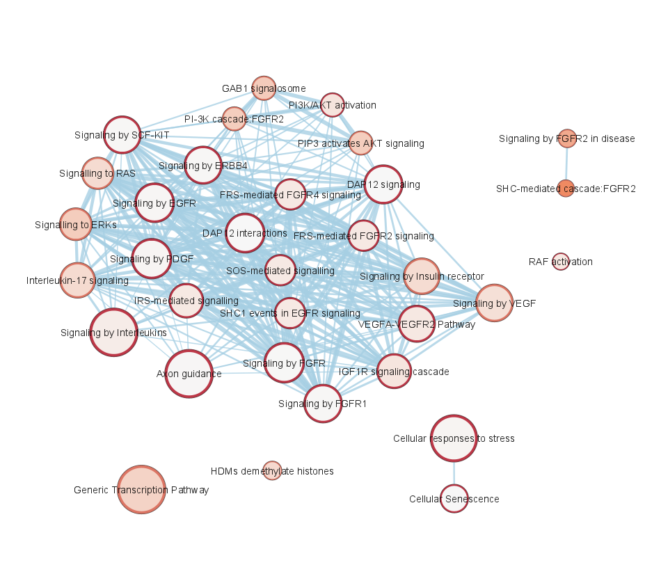

```{r, echo=FALSE}
knitr::opts_chunk$set(warning=FALSE, 
                      message=FALSE, 
                      width=500)
options(max.print=35)
```

# Multi-omics pathway enrichment analysis


## Introduction
ActivePathways is a method for analysing multiple omics datasets in the context of molecular pathways, biological processes and other types of gene sets. The package uses p-value merging to combine gene- or protein-level signals, followed by ranked hypergeometric tests to determine enriched pathways and processes. This approach allows researchers to interpret a series of omics datasets in the context of known biology and gene function, and discover associations that are only apparent when several datasets are combined. 

The package is part of the following publication: 

Integrative Pathway Enrichment Analysis of Multivariate Omics Data. Paczkowska M, Barenboim J, Sintupisut N, Fox NS, Zhu H, Abd-Rabbo D, Mee MW, Boutros PC, PCAWG Drivers and Functional Interpretation Working Group; Reimand J, PCAWG Consortium. Nature Communications (2020) <https://doi.org/10.1038/s41467-019-13983-9>.

## Pathway enrichment analysis using the ranked hypergeometric test

From a matrix of p-values, `ActivePathways` creates a ranked gene list where genes are prioritised based on their combined significance of in the series of omics datasets provided in the input matrix. The ranked gene list includes the most significant genes first. `ActivePathways` then performs a ranked hypergeometric test to determine if a pathway (i.e., a gene set with a common functional annotation) is enriched in the ranked gene list, by performing a series of hypergeometric tests (also known as Fisher's exact tests). In each such test, a larger set of genes from the top of the ranked gene list is considered. At the end of the series, the ranked hypergeometric test returns the top most significant p-value from the series, corresponding to the point in the ranked gene list where the pathway enrichment reached the greatest significance of enrichment. This approach is useful when the genes in our ranked gene list have varying signals of biological importance in the input omics datasets, as the test identifies the top subset of genes that are the most relevant to the enrichment of the pathway.

## Using the package
A basic example of using ActivePathways is shown below. 

We will analyse cancer driver gene predictions for a collection of cancer genomes. Each dataset (i.e., column in the matrix) contains a statistical significance score (P-value) where genes with small P-values are considered stronger candidates of cancer drivers based on the distribution of mutations in the genes. For each gene (i.e., row in the matrix), we have several predictions representing genomic elements of the gene, such as coding sequences (CDS), untranslated regions (UTR), and core promoters (promCore). 


To analyse these driver genes using existing knowledge of gene function, we will use gene sets corresponding to known molecular pathways from the Reactome database. These gene sets are commonly distributed in text files in the GMT format [(Gene Matrix Transposed)](https://software.broadinstitute.org/cancer/software/gsea/wiki/index.php/Data_formats#GMT:_Gene_Matrix_Transposed_file_format_.28.2A.gmt.29) file.

Let's start by reading the data from the files embedded in the R package. For the p-value matrix, `ActivePathways` expects an object of the matrix class so the table has to be cast to the correct class after reading the file.
```{r}
scores <- read.table(
system.file('extdata', 'Adenocarcinoma_scores_subset.tsv', package = 'ActivePathways'), 
header = TRUE, sep = '\t', row.names = 'Gene')
scores <- as.matrix(scores)
scores
```

`ActivePathways` does not allow missing (NA) values in the matrix of P-values and these need to be removed. One conservative option is to re-assign all missing values as ones, indicating our confidence that the missing values are not indicative of cancer drivers. Alternatively, one may consider removing genes with NA values. 
```{r}
scores[is.na(scores)] <- 1
```

## Basic use
The basic use of `ActivePathways` requires only two input parameters, the matrix of P-values with genes in rows and datasets in columns, as prepared above, and the path to the GMT file in the file system. Here we use a GMT file provided with the package. Importantly, the gene IDs (symbols, accession numbers, etc) in the P-value matrix need to match those in the GMT file. 
```{r}
library(ActivePathways)
gmt.file <- system.file('extdata', 'hsapiens_REAC_subset.gmt', package = 'ActivePathways')
ActivePathways(scores, gmt.file)
```


## Significance threshold and returning all results
A pathway is considered to be significantly enriched if it has `adjusted.p.val <= significant`. The parameter `significant` represents the maximum adjusted P-value for a resulting pathway to be considered statistically significant. Only the significant pathways are returned. P-values from pathway enrichment analysis are adjusted for multiple testing correction to provide a more conservative analysis (see below). 
```{r}
nrow(ActivePathways(scores, gmt.file, significant = 0.05))
nrow(ActivePathways(scores, gmt.file, significant = 0.1))
```


## GMT objects
In the most common use case, a GMT file is downloaded from a database and provided directly to `ActivePathways` as a location in the file system. In some cases, it may be useful to load a GMT file separately for preprocessing. The ActivePathways package includes an interface for working with GMT objects. The GMT object can be read from a file using the `read.GMT` function. The GMT is structured as a list of terms (e.g., molecular pathways, biological processes, etc.). In the GMT object, each term is a list containing an id, a name, and the list of genes associated with this term. 
```{r}
gmt <- read.GMT(gmt.file)
names(gmt[[1]])

# Pretty-print the GMT
gmt[1:3]

# Look at the genes annotated to the first term
gmt[[1]]$genes

# Get the full name of Reactome pathway 2424491
gmt$`REAC:2424491`$name
```

The most common processing step for GMT files is the removal of gene sets that are too large or small. Here we remove pathways (gene sets) that have less than 10 or more than 500 annotated genes. 
```{r}
gmt <- Filter(function(term) length(term$genes) >= 10, gmt)
gmt <- Filter(function(term) length(term$genes) <= 500, gmt)
```

The new GMT object can now be used for analysis with `ActivePathways`
```{r}
ActivePathways(scores, gmt)
```

This filtering can also be done automatically using the `geneset.filter` option to the `ActivePathways` function. By default, `ActivePathways` removes gene sets with less than five or more than a thousand genes from the GMT prior to analysis. In general, gene sets that are too large are likely not specific and less useful in interpreting the data and may also cause statistical inflation of enrichment scores in the analysis. Gene sets that are too small are likely too specific for most analyses and also make the multiple testing corrections more stringent, potentially causing deflation of results. 
A stricter filter can be applied by running `ActivePathways` with the parameter `geneset.filter = c(10, 500)`.

```{r}
ActivePathways(scores, gmt.file, geneset.filter = c(10, 500))
```

This GMT object can be saved to a file
```{r, eval=FALSE}
write.GMT(gmt, 'hsapiens_REAC_subset_filtered.gmt')
```


## Background gene set for statistical analysis 
To perform pathway enrichment analysis, a global set of genes needs to be defined as a statistical background set. This represents the universe of all genes in the organism that the analysis can potentially consider. By default, this background gene set includes every gene that is found in the GMT file in any of the biological processes and pathways. Another option is to provide the full set of all protein-coding genes, however this may cause statistical inflation of the results since a sizable fraction of all protein-coding genes still lack any known function. 

Sometimes the statistical background set needs to be considerably narrower than the GMT file or the full set of genes. Genes need to be excluded from the background if the analysis or experiment specifically excluded these genes initially. An example would be a targeted screen or sequencing panel that only considered a specific class of genes or proteins (e.g., kinases). In analysing such data, all non-kinase genes need to be excluded from the background set to avoid statistical inflation of all gene sets related to kinase signalling, phosphorylation and similar functions. 

To alter the background gene set in `ActivePathways`, one can provide a character vector of gene names that make up the statistical background set. In this example, we start from the original list of genes in the entire GMT and remove one gene, the tumor suppressor TP53. The new background set is then used for the ActivePathways analysis.

```{r}
background <- makeBackground(gmt)
background <- background[background != 'TP53']
ActivePathways(scores, gmt.file, background = background)
```

Note that only the genes found in the background set are used for testing enrichment. Any genes in the input data that are not in the background set will be automatically removed by `ActivePathways`.


## Merging p-values
A key feature of `ActivePathways` is the integration of multiple complementary omics datasets to prioritise genes for the pathway analysis. In this approach, genes with significant scores in multiple datasets will get the highest priority, and certain genes with weak scores in multiple datasets may be ranked higher, highlighting functions that would be missed when only single datasets were analysed. `ActivePathways` accomplishes this by merging the series of p-values in the columns of the scores matrix for each gene into a single combined P-value. The two main methods to merge P-values are Brown's method (the default) and Fisher's method. The Brown’s method is more accurate and/or conservative in the case when the input datasets show some large-scale similarities (i.e., covariation), since the Brown’s method will take that into account when prioritising genes across similar datasets. The Brown’s method is recommended for most cases since omics datasets are often not statistically independent of each other and genes with high scores in one dataset are more likely to have high scores in another dataset just by chance. 

The following example compares the merged P-values of the first few genes between the two methods. The genes with the top scores are the same while the P-values of the second method are somewhat more conservative. 
```{r}
sort(merge_p_values(scores, 'Fisher'))[1:5]
sort(merge_p_values(scores, 'Brown'))[1:5]
```

This function can be used to combine some of the data before the analysis for any follow-up analysis or visualisation. For example, we can merge the columns `X5UTR`, `X3UTR`, and `promCore` into a single `non_coding` column (these correspond to predictions of driver mutations in 5’UTRs, 3’UTRs and core promoters of genes, respectively). This will consider the three non-coding regions as a single column, rather than giving them all equal weight to the `CDS` column.
```{r}
scores2 <- cbind(scores[, 'CDS'], merge_p_values(scores[, c('X3UTR', 'X5UTR', 'promCore')], 'Brown'))
colnames(scores2) <- c('CDS', 'non_coding')
scores[c(2179, 1760),]
scores2[c(2179, 1760),]

ActivePathways(scores, gmt.file)
ActivePathways(scores2, gmt.file)
```


## Cutoff for filtering the ranked gene list for pathway enrichment analysis
To perform pathway enrichment of the ranked gene list of merged P-values, `ActivePathways` defines a P-value cutoff to filter genes that have little or no significance in the series of omics datasets. This threshold represents the maximum p-value for a gene to be considered of interest in our analysis. The threshold is `0.1` by default, but can be changed using the `cutoff` option. The default option considers raw P-values that have not been adjusted for multiple-testing correction. Therefore the default option provides a relatively lenient approach to filtering the input data. This is useful for finding additional genes with weaker signals that associate with well-annotated and strongly significant genes in the pathway and functional context. 

```{r}

nrow(ActivePathways(scores, gmt.file))
nrow(ActivePathways(scores, gmt.file, cutoff = 0.01))

```


## Adjusting P-values using multiple testing correction
Multiple testing correction is essential in the analysis of omics data since each analysis routinely considers thousands of hypotheses and apparently significant P-values will occur by chance alone. `ActivePathways` uses multiple testing correction at the level of pathways as P-values from the ranked hypergeometric test are adjusted for multiple testing (note that the ranked gene list provided to the ranked hypergeometric test remain unadjusted for multiple testing by design).
 
The package uses the `p.adjust` function of base R to run multiple testing corrections and all methods in this function are available. By default, 'holm' correction is used. The option `correction.method = 'none'` can be used to override P-value adjustment (not recommended in most cases). 

```{r}

nrow(ActivePathways(scores, gmt.file))
nrow(ActivePathways(scores, gmt.file, correction.method = 'none'))

```


## The results table of ActivePathways

Consider the results object from the basic use case of `ActivePathways`
```{r}
res <- ActivePathways(scores, gmt.file)
res
```
The columns `term.id`, `term.name`, and `term.size` give information about each pathway detected in the enrichment analysis. The `adjusted.p.val` column with the adjusted P-value indicates the confidence that the pathway is enriched after multiple testing correction. 

The `overlap` column provides the set of genes from the integrated gene list that occur in the given enriched gene set (i.e., molecular pathway or biological process). These genes were quantified across multiple input omics datasets and prioritized based on their joint significance in the input data. Note that the genes with the strongest scores across the multiple datasets are listed first. 

```{r}
res$overlap[1:3]
```

This column is useful in the further analysis on the data, allowing the researcher to go move from the space of enriched pathways back to space of individual genes and proteins involved in the pathways and the input omics datasets. 


The `evidence` column provides insights to which of the input omics datasets (i.e., columns in the scores matrix) contributed to the discovery of this pathway or process in the integrated enrichment analysis. To achieve this level of detail, `ActivePathways` also analyses the gene lists ranked by the individual columns of the input matrix to detect enriched pathways. The `evidence` column lists the name of a given column of the input matrix if the given pathway is detected both in the integrated analysis and the analysis of the individual column. For example, in this analysis the majority of the detected pathways have only 'CDS' as their evidence, since these pathways were found to be enriched in data fusion through P-value merging and also by analysing the gene scores in the column `CDS` (for reference, CDS corresponds to protein-coding sequence where the majority of known driver mutations have been found). As a counter-example, the record for the pathway `REAC:422475` in our results lists as evidence `list('X3UTR', 'promCore')`, meaning that the pathway was found to be enriched when considering either the `X3UTR` column, the `promCore` column, or the combined omics datasets. 

```{r}
res[res$term.id == "REAC:422475","evidence"]
```

Finally, if a pathway is found to be enriched only with the combined data and not in any individual column, 'combined' will be listed as the evidence. This subset of results may be particularly interesting since it highlights complementary aspects of the analysis that would remain hidden in the analysis of any input omics dataset separately. 

The following  columns named as `Genes_{column}` help interpret how each pathway was detected in the multi-omics data integration, as listed in the column `evidence`. These columns show the genes present in the pathway and any of the the input omics datasets. If the given pathway was not identified using the scores of the given column of the input scores matrix, an `NA` value is shown. Again, the genes are ranked in by the significance of their scores in the input data, to facilitate identification of the most relevant genes in the analysis. 


## Writing results to a CSV file
The results are returned as a `data.table` object due to some additional data structures needed to store lists of gene IDs and supporting evidence. The usual R functions `write.table` and `write.csv` will struggle with exporting the data unless the gene and evidence lists are manually transformed as strings. Fortunately, the `fwrite` function of `data.table` can be used to write the file directly and the ActivePathways package includes the function `export_as_CSV` as a shortcut that uses the vertical bar symbol to concatenate gene lists. 

```{r, eval = FALSE}
result.file <- paste('ActivePathways_results.csv', sep = '/')
export_as_CSV (res, result.file) # remove comment to run
read.csv(result.file, stringsAsFactors = F)[1:3,]
```

The `fwrite` can be called directly for customised output. 

```{r, eval=FALSE}
result.file <- paste('ActivePathways_results2.txt', sep = '/')
data.table::fwrite(res, result.file, sep = '\t', sep2 = c('', ',', ''))
cat(paste(readLines(result.file)[1:2], collapse = '\n'))
```

# Visualising pathway enrichment results using enrichment maps in Cytoscape

The Cytoscape software and the EnrichmentMap app provide powerful tools to visualise the enriched pathways from `ActivePathways` as a network (i.e., an Enrichment Map). To facilitate this visualisation step, `ActivePathways` provides the files needed for building enrichment maps. To create these files, a file prefix must be supplied to `ActivePathways` using the argument `cytoscape.file.tag`. The prefix can be a path to an existing writable directory.
 
```{r, eval=FALSE}
res <- ActivePathways(scores, gmt.file, cytoscape.file.tag = "enrichmentMap__")
```
Four files are written using the prefix:

* `enrichmentMap__pathways.txt` contains the table of significant terms (i.e. molecular pathways, biological processes, other gene sets) and the associated adjusted P-values. Note that only terms with `adjusted.p.val <= significant` are written.

* `enrichmentMap__subgroups.txt` contains a matrix indicating the columns of the input matrix of P-values that contributed to the discovery of the corresponding pathways. These values correspond to the `evidence` evaluation of input omics datasets discussed above, where a value of one indicates that the pathway was also detectable using a specific input omics dataset. A value of zero indicates otherwise. This file will be not generated if a single-column matrix of scores corresponding to just one omics dataset is provided to `ActivePathways`.

* `enrichmentMap__pathways.gmt` contains a shortened version of the supplied GMT file which consists of only the significant pathways detected by `ActivePathways`. 

* `enrichmentMap__legend.pdf` is a pdf file that displays a color legend of different omics datasets visualised in the enrichment map that can be used as a reference to the generated enrichment map.

## Creating enrichment maps using results of ActivePathways 

The following sections will discuss how to create a pathway enrichment map using the results from `ActivePathways`. The datasets analysed earlier in the vignette will be used ActivePathways vignette. To follow the steps, save the required files from `ActivePathways` in an accessible location.

## Required software

1.	Cytoscape, see <https://cytoscape.org/download.html>
2.	EnrichmentMap app of Cytoscape, see menu Apps>App manager or <http://apps.cytoscape.org/apps/enrichmentmap> 
3.	EhancedGraphics app of Cytoscape, see menu Apps>App manager or <http://apps.cytoscape.org/apps/enhancedGraphics> 

## Required files

`ActivePathways` writes four files that are used to build enrichment maps in Cytoscape. 
```{r}
files <- c(system.file('extdata', 'enrichmentMap__pathways.txt', package='ActivePathways'),
           system.file('extdata', 'enrichmentMap__subgroups.txt', package='ActivePathways'),
           system.file('extdata', 'enrichmentMap__pathways.gmt', package='ActivePathways'),
           system.file('extdata', 'enrichmentMap__legend.pdf', package='ActivePathways'))
```

The following commands will perform the basic analysis again and write output files required for generating enrichment maps into the current working directory of the R session. All file names use the prefix ` enrichmentMap__`. The generated files are also available in the `ActivePathways` R package as shown above. 

```{r, eval=FALSE}
gmt.file <- system.file('extdata', 'hsapiens_REAC_subset.gmt', package = 'ActivePathways')
scores.file <- system.file('extdata', 'Adenocarcinoma_scores_subset.tsv', package = 'ActivePathways')

scores <- read.table(scores.file, header = TRUE, sep = '\t', row.names = 'Gene')
scores <- as.matrix(scores)
scores[is.na(scores)] <- 1

res <- ActivePathways(scores, gmt.file, cytoscape.file.tag = "enrichmentMap__")
```

The four files written are:

* `enrichmentMap__pathways.txt`, a table of significant pathways and the associated adjusted P-values.

* `enrichmentMap__subgroups.txt`, a table of pathways and corresponding omics datasets supporting the enrichment of those pathways. This corresponds to the `evidence` column of the `ActivePathways` result object discussed above. 
* `enrichmentMap__pathways.gmt`, a shortened version of the supplied GMT file which consists of only the significant pathways detected by `ActivePathways`. 

* `enrichmentMap__legend.pdf`, a reference color legend of different omics datasets visualised in the enrichment map.

The following code will examine a few lines of the files generated by `ActivePathways`. 

```{r}
cat(paste(readLines(files[1])[1:5], collapse='\n'))
cat(paste(readLines(files[2])[1:5], collapse='\n'))
cat(paste(readLines(files[3])[18:19], collapse='\n'))
```

## Creating the enrichment map

* Open the Cytoscape software. 
* Ensure that the apps *EnrichmentMap* and *enchancedGraphics* are installed. Apps may be installed by clicking in the menu *Apps -> App Manager*. 
* Select *Apps -> EnrichmentMap*. 
* In the following dialogue, click the button `+` *Add Data Set from Files* in the top left corner of the dialogue.
* Change the Analysis Type to Generic/gProfiler/Enrichr.
* Upload the files `enrichmentMap__pathways.txt` and `enrichmentMap__pathways.gmt` in the *Enrichments* and *GMT* fields, respectively. 
* Click the checkbox *Show Advanced Options* and set *Cutoff* to 0.6.
* Then click *Build* in the bottom-right corner to create the enrichment map. 





## Colour the nodes of the network to visualise supporting omics datasets

To color nodes in the network (i.e., molecular pathways, biological processes) according to the omics datasets supporting the enrichments, the third file `enrichmentMap__subgroups.txt` needs to be imported to Cytoscape directly. To import the file, activate the menu option *File -> Import -> Table from File* and select the file `enrichmentMap__subgroups.txt`. In the following dialogue, select *To a Network Collection* in the dropdown menu *Where to Import Table data*. Click OK to proceed. 


Next, Cytoscape needs to use the imported information to color nodes using a pie chart visualisation. To enable this click the Style tab in the left control panel and select the Image/Chart1 Property in a series of dropdown menus (*Properties -> Paint -> Custom Paint 1 -> Image/Chart 1*). 


The *image/Chart 1* property now appears in the Style control panel. Click the triangle on the right, then set the *Column* to *instruct* and the *Mapping type* to *Passthrough*. 


This step colours the nodes corresponding to the enriched pathways according to the supporting omics datasets, based on in the scores matrix initially analysed in `ActivePathways`. 


To allow better interpretation of the enrichment map, `ActivePathways` generates a color legend in the file `enrichmentMap__legend.pdf` that shows which colors correspond to which omics datasets. 


Note that one of the colors corresponds to a subset of enriched pathways with *combined* evidence that were only detected through data fusion and P-value merging and not when any of the input datasets were detected separately. This exemplifies the added value of integrative multi-omics pathway enrichment analysis. 

# References

* Integrative Pathway Enrichment Analysis of Multivariate Omics Data. Paczkowska M, Barenboim J, Sintupisut N, Fox NS, Zhu H, Abd-Rabbo D, Mee MW, Boutros PC, PCAWG Drivers and Functional Interpretation Working Group; Reimand J, PCAWG Consortium. Nature Communications (2020) <https://pubmed.ncbi.nlm.nih.gov/32024846/> <https://doi.org/10.1038/s41467-019-13983-9>.

* Pathway Enrichment Analysis and Visualization of Omics Data Using g:Profiler, GSEA, Cytoscape and EnrichmentMap. Reimand J, Isserlin R, Voisin V, Kucera M, Tannus-Lopes C, Rostamianfar A, Wadi L, Meyer M, Wong J, Xu C, Merico D, Bader GD. Nature Protocols (2019) <https://pubmed.ncbi.nlm.nih.gov/30664679/> <https://doi.org/10.1038/s41596-018-0103-9>.
