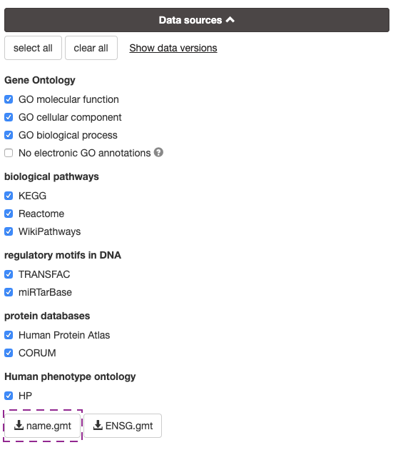
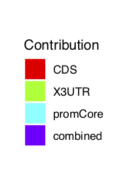

```{r, echo=FALSE}
knitr::opts_chunk$set(warning=FALSE, 
                      message=FALSE, 
                      width=500)
options(max.print=35)
```

# Introduction
ActivePathways is a tool for multivariate pathway enrichment analysis. Pathway enrichment analysis identifies gene sets, such as pathways or Gene Ontology terms, that are over-represented in a list of genes of interest. ActivePathways implements an algorithm to perform pathway enrichment analysis on a data set that contains multiple variables for each gene. For example, the data may contain the confidence that the gene is a driver as reported by several tools, or it may contain differential expression values across different genetic regions such as coding regions and promoter regions.

## Pathway Enrichment and The Ordered Hypergeometric algorithm

From a matrix of p-values, `ActivePathways` creates a gene list query by merging the values to determine a single score for each gene, then filtering and sorting this list of p-values. This creates a list of genes - which we'll creatively call the `genelist` - ordered most significant first. `ActivePathways` tests if a pathway is 'enriched', or over-represented in our gene list, by performing a hypergeometric test (aka a Fisher's exact test) on the `genelist` and the genes annotated to the pathway. But rather than testing the entire `genelist`, `ActivePathways` performs incremental enrichment analysis with an increasingly larger subset of `genelist` starting at the top of the list, and takes the subset of `genelist` that yields the smallest p-value. This approach is useful when the genes in our `genelist` are of varying biological importance as it identifies the genes most relevant to the enrichment of the pathway.


# Tutorial
In this vignette we will be looking at a basic use case. Our data is a small subset of genes and driver scores, representing the confidence that the gene is a driver in Adenocarcinoma cancers. Driver scores are given separately for different genetic elements; untranslated regions, coding regions, and promoters. For our gene sets, we'll be using a small subset of the Reactome database in the form of a GMT [(Gene Matrix Transposed)](https://software.broadinstitute.org/cancer/software/gsea/wiki/index.php/Data_formats#GMT:_Gene_Matrix_Transposed_file_format_.28.2A.gmt.29) file. GMT files can be downloaded from the [g:ProfileR server](https://biit.cs.ut.ee/gprofiler/gost). Click on Data sources, select database preferences and download the `name.gmt` file.



Let's start off by reading the data from the file. `ActivePathways` expects a matrix so the table has to be cast to the correct class.
```{r}
scores <- read.table(system.file('extdata', 'Adenocarcinoma_scores_subset.tsv', package='ActivePathways'), header=TRUE, sep='\t', row.names='Gene')
scores <- as.matrix(scores)
scores
```

Additionally, `ActivePathways` will not allow any missing values. If there are missing values in the data they will have to somehow be removed. One possibility is to remove any rows that contain a missing value. Alternatively you can treat missing values as a p-value of 1, meaning we are confident the gene isn't a driver.

```{r}
scores[is.na(scores)] <- 1
```


## Basic Use
The `ActivePathways` function can be very simple to use. There are several parameters, but only two are required. The first is the data matrix, which we prepared above. The second is a path to the GMT file.

```{r}
library(ActivePathways)
gmt.file <- system.file('extdata', 'hsapiens_REAC_subset.gmt', package='ActivePathways')
ActivePathways(scores, gmt.file)
```

## Significance Threshold and Returning All Results
A pathway is considered to be significantly enriched if it has `p.val <= significant`. The `significant` option represents the maximum p-value for a result to be considered statistically significant. By default, only the significant pathways are returned. If you want all pathways to be returned, you can use the `return.all` option. 

```{r}
nrow(ActivePathways(scores, gmt.file, return.all=FALSE, significant=0.05))
nrow(ActivePathways(scores, gmt.file, return.all=FALSE, significant=0.1))
nrow(ActivePathways(scores, gmt.file, return.all=TRUE, significant=0.05))
```
Note that while setting `significant=1` gives the same result as `return.all=TRUE`, it is strongly recommended to use the latter because the results written to `cytoscape.file.dir` use the `significant` value to determine which pathways to include in the network. Thus `ActivePathways(scores, gmt.file, return.all=TRUE, cytoscape.file.dir='/results/directory/')` and `ActivePathways(scores, gmt.file, significant=1, cytoscape.file.dir='/results/directory/)` will return the same result table but will create very different enrichment maps.


## GMT objects
While you can just give the location of the GMT file to `ActivePathways`, in some cases you might want to look at this GMT or filter it first. For this reason the ActivePathways package includes an interface for working with GMT objects. You can read the GMT object with the `read.GMT` function. The GMT is structured as a list of terms, where each term is a list containing an id, a name, and a list of genes
```{r}
gmt <- read.GMT(gmt.file)
names(gmt[[1]])

# Pretty-print the GMT
gmt[1:3]

# Look at the genes annotated to the first term
gmt[[1]]$genes

# Get the full name of Reactome pathway 2424491
gmt$`REAC:2424491`$name
```

A common filter to apply to the GMT is to remove gene sets that are too large or small in order to remove pathways that are overly general or specific. We'll remove any pathways that have less than 10 or more than 500 genes annotated to them.
```{r}
gmt <- Filter(function(term) length(term$genes) >= 10, gmt)
gmt <- Filter(function(term) length(term$genes) <= 500, gmt)
```
This filtering can also be done automatically using the `geneset.filter` option to the `ActivePathways` function. By default `ActivePathways` removes any gene sets with less than 5 or more than 1000 annotated genes. Our stricter filter can be applied inside `ActivePathways` using the option `geneset.filter=c(10, 500)`

The new GMT object can now be used for analysis with `ActivePathways`
```{r}
ActivePathways(scores, gmt)
```

You can also save this GMT object to a file so that you don't have to repeat this process next time
```{r, eval=FALSE}
write.GMT(gmt, 'hsapiens_REAC_subset_filtered.gmt')
```


## Backgrounds
To perform pathway enrichment analysis a set of genes is needed to act as a statistical background. You can think of this background as a universe of all genes that we're interested in. By default, the background is every gene found at least once in the GMT, but you can supply your own as a character vector. You might find it helpful to start with the list of all genes in the GMT, which you can get with the `makeBackground` function. For example, let's say we're interested in every gene except for TP53. This gene can be removed from the background and the new background used for our analysis.
```{r}
background <- makeBackground(gmt)
background <- background[background != 'TP53']
ActivePathways(scores, gmt.file, background=background)
```
Note that only genes found in the background are used for testing enrichment. Any genes in the input data that aren't in the background will be automatically removed by `ActivePathways`.


## Merging p-values
Our input file consisted of multiple scores for each gene, but in order to perform pathway enrichment analysis each gene needs to have a single score. `ActivePathways` accomplishes this by merging the p-values for each gene into a single combined score. The two main methods to merge p-values are Brown's method (the default) and Fisher's method, but other methods are also available. You can preview the merged p-values using the `merge_p_values` function.

```{r}
scores
merge_p_values(scores, 'Fisher')
merge_p_values(scores, 'Brown')
```

You can also use this function to combine some of the data before hand. For example, we can merge the `X3UTR`, `X5UTR`, and `promCore` columns into a single `non_coding` column. This will consider the three non-coding regions as a single column, rather than giving them all equal weight to the `CDS` column.

```{r}
scores2 <- cbind(scores[, 'CDS'], merge_p_values(scores[, c('X3UTR', 'X5UTR', 'promCore')], 'Brown'))
colnames(scores2) <- c('CDS', 'non_coding')
scores
scores2

ActivePathways(scores, gmt.file)
ActivePathways(scores2, gmt.file)
```


## Cutoff
In addition to removing any genes not found in the background, `ActivePathways` also removes any genes that have a high p-value after merging the scores. This threshold represents the maximum p-value for a gene to be considered of interest in our analysis. The threshold is `0.1` by default, but can be changed using the `cutoff` option.


## p-value adjustment
To avoid inflated p-values that arise from multiple testing, p-values are adjusted after running enrichment analysis on each pathway. `ActivePathways` uses the base R `p.adjust` function to adjust p-values, so all of those methods are available. By default, 'holm' correction is used. You can also use `correction.method='none'` to not perform any p-value adjustment at all.


# The Results Table

Lets take a look again at the results from the basic case.
```{r}
res <- ActivePathways(scores, gmt.file)
res
```
The `term.id`, `term.name`, and `term.size` column give information about each pathway. The `p.val` column gives the adjusted p-value for each column indicating the confidence that the pathway is enriched. Since the `return.all` options is `FALSE` by default, all of these p-values will be smaller than the default significance cutoff, 0.05, and the table contains only the pathways that were found to be significant enriched. 

The `overlap` column gives the intersection between the genes annotated to the term and the subset of the `genelist` that gave us this p.value.
```{r}
res$overlap[1:3]
```
The overlaps are in the same order as the `genelist`, meaning that the most significant genes from `scores` are placed first. This column is very useful in further analysis on the data, going back from pathway space to gene space and identifying significant genes in each pathway.

The `evidence` column gives the individual gene lists in `scores` in which the pathway is found to be enriched. For example, the majority of the pathways have only 'CDS' as their evidence, meaning that the pathway is enriched either in this column or in the combined data. Pathway `REAC:422475` has as evidence `list('X3UTR', 'promCore')`, which means that the pathway is found to be enriched when considering either the `X3UTR` column, the `promCore` column, or the combined data. If a pathway is found to be enriched only with the combined data and not in any individual column, 'combined' will be listed as the evidence. If a pathway is not found to be enriched in any individual column or in the combined data (only possible if `return.all==TRUE`) then the evidence will be 'none'.  

The rest of the columns are named as `Genes_{column}`, and represent the overlaps of each individual column if a pathway is found to be enriched according only to that gene list. Otherwise the column is `NA`.

### Writing results to file
The results are returned as a `data.table`, but since the overlap column is a list it adds some challenges to writing the table to a file, should you need to. The usual `write.table` and `write.csv` functions will struggle with this column unless you manually transform the list into a string. Fortunately, `data.table`'s `fwrite` function is smart enough to handle the complex structure

```{r}
result.file <- paste(system.file('extdata', package='ActivePathways'), 'example_write.csv', sep='/')

data.table::fwrite(res, result.file)
```

```{r, echo=FALSE}
knitr::kable(read.csv(result.file)[1:3, 1:4], caption = "Write results as csv file using data.table::fwrite - first 4 columns shown here")
```

However, `data.table::fread` isn't quite smart enough to get the table back from the file, so you will have to do a little more work to turn the overlap column from a string to a list if you want to read the results from a file.


# Visualizing the Results in Cytoscape
The Cytoscape program, combined with the enrichmentMap app, provide a powerful tool to visualize pathway enrichment analysis as a network. `ActivePathways` can help speed up this process by automatically writing the files that will be uploaded to Cytoscape to create a map. To create these files, a list of file names must be supplied to `ActivePathways`
```{r}

res <- ActivePathways(scores, gmt.file, cytoscape.file.dir = system.file('extdata', package='ActivePathways'))
```
Four files are written:

* `pathways.txt` contains the list of significant terms and the associated p-values. Note that only terms with `p.val <= significant` are written, even if you use the option `return.all=TRUE`.

* `subgroups.txt` contains a matrix indicating which columns the pathways are significant in. A 1 indicates that that pathway is significant if `ActivePathways` is run on the data in just that one column. Note that this isn't the same as the column contribution. However, this file will be skipped if you use the option `contribution=FALSE`, since the assumption is that the individual columns aren't of interest.

* `pathways.gmt` contains a shortened version of the supplied GMT file which consists of only the significant pathways. You don't have to use this file, but it helps speed up the process of creating the network inside Cytoscape.

* `legend.pdf` a pdf file of a legend which can be used as reference to the generated cytoscape plot.

```{r}
files <- paste(system.file('extdata', package='ActivePathways'), 
               c('pathways.txt', 
                 'subgroups.txt', 
                 'pathways.gmt', 
                 'legend.pdf'), 
               sep='/')

cat(paste(readLines(files[1])[1:5], collapse='\n'))
cat(paste(readLines(files[2])[1:5], collapse='\n'))
cat(paste(readLines(files[3])[1], collapse='\n'))
```



To see how to use these files to create an enrichment map, take a look at the `enrichmentMap-vignette` included with this package.
