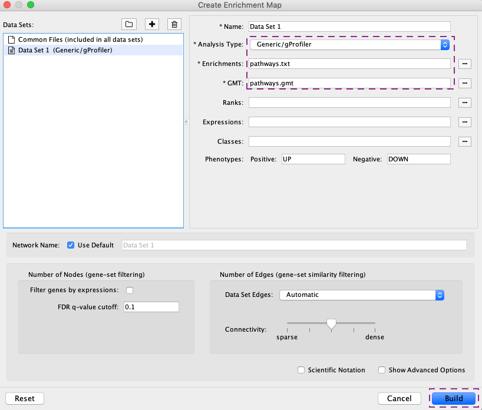
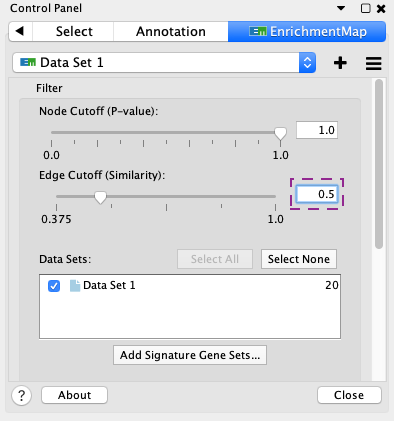
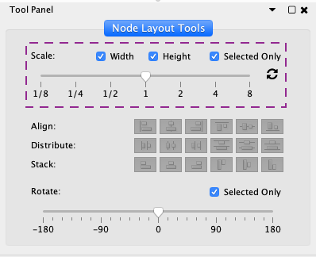
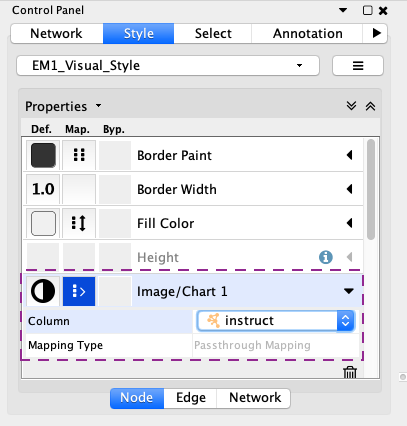

```{r, echo=FALSE}
knitr::opts_chunk$set(warning=FALSE, 
                      message=FALSE, 
                      width=500)
```

# Introduction

This tutorial demonstrates how to create a pathway enrichment map using the results from ActivePathways. An enrichment map is a technique for visualizing enriched pathways derived from *omics* data analysis and EnrichmentMap is a Cytoscape app for creating such visualizations [(1)](https://journals.plos.org/plosone/article?id=10.1371/journal.pone.0013984). This tutorial uses results from the main ActivePathways vignette. ActivePathways creates the files for EnrichmentMap. To follow instructions in this vignette, use any Cytoscape files written by ActivePathways or follow the main ActivePathways vignette, ensuring that the Cytoscape files are saved in an accessible location. For further information on enrichment maps, see the protocol paper in Nature Protocols [(2)](https://www.nature.com/articles/s41596-018-0103-9).

## Required Files

Recall that `ActivePathways` writes four files to be used in Cytoscape.
```{r}
files <- c(system.file('extdata', 'pathways.txt', package='ActivePathways'),
           system.file('extdata', 'subgroups.txt', package='ActivePathways'),
           system.file('extdata', 'pathways.gmt', package='ActivePathways'),
           system.file('extdata', 'legend.pdf', package ='ActivePathways'))
```
```{r, eval=FALSE}
# Not run. 
res <- ActivePathways(dat, gmt, cytoscape.file.dir='path/to/results/directory')
```
The files written are:

* `pathways.txt` contains the list of significant pathways and the associated p-values. Note that only terms with `p.val <= significant` are written, even if the option `return.all=TRUE` is specified.

* `subgroups.txt` contains a matrix indicating the columns of the original scores matrix which contributed significant pathways. A value of 1 indicates that the pathway is also significant if ActivePathways is run on the p-values in that column, indicating that the pathway would be also identified by only analysing that dataset alone. 

* `pathways.gmt` contains a shortened version of the supplied GMT file which includes only the significant pathways and associated genes. This abridged file can accelerate the process of creating the network using Cytoscape.

* `legend.pdf` is a graphics file of PDF format that displays the color legend that can be used as a reference to the generated Cytoscape network.

```{r}
cat(paste(readLines(files[1])[1:3], collapse='\n'))
cat(paste(readLines(files[2])[1:5], collapse='\n'))
cat(paste(readLines(files[3])[1], collapse='\n'))
```

## Creating the Enrichment Map
Open Cytoscape and ensure the *EnrichmentMap* and *enchancedGraphics* apps are installed. Apps may be installed by clicking *Apps -> App Manager* in Cytoscape. When the apps are installed, open the Apps menu again and click Enrichment Map. In the window that opens, click the *Add Data Set from Files* button (The '+') in the top left, change the *Analysis Type* to 'Generic/gProfiler' and upload the `pathways.txt` and `pathways.gmt` files.



Click *Build* to create the network.


**P.S.** To make network more visually appealing, the Edge Cutoff slider in the EnrichmentMap tab of the Control Panel can be adjusted to determine the similarity coefficient (we recommend 0.5 or 0.6) and reduce the number of edges, the scale in the Tool Panel (View > Show Tool Panel) can be used to resize nodes, and the layout can be changed in the Layout tab (yFilesLayouts can be installed in apps, Layout > yFilesLayouts).






## Colouring the Nodes by Subgroup
To upload the `subgroups.txt` table, go to *File* > *Import* > *Table* > *File* and import the `subgroups.txt` file.

Click the *Style* tab in the *Control* panel and ensure the *Image/Chart1* property is available. Under the *Image/Chart 1* property, set the *Column* to 'instruct' and the *Mapping Type* to 'passthrough'.



This setting colours the pathway nodes according to the columns (types of evidence) in which the pathway is found to be enriched when considering the initial p-value matrix only one column at a time. 


For the sake of convenience, ActivePathways generates the file Legend.pdf which can be added to the enrichment map using an image editing tool.


## References

1. Merico, Daniele, et al. "Enrichment map: a network-based method for gene-set enrichment visualization and interpretation." PloS one 5.11 (2010): e13984.

2. Reimand, Jüri, et al. "Pathway enrichment analysis and visualization of omics data using g: Profiler, GSEA, Cytoscape and EnrichmentMap." Nature protocols 14.2 (2019): 482.
