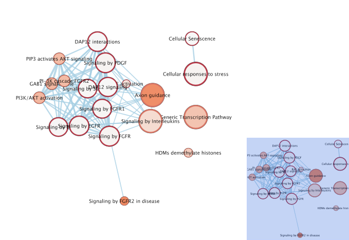
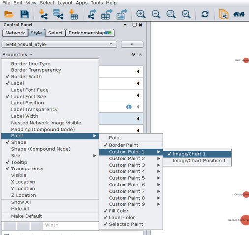
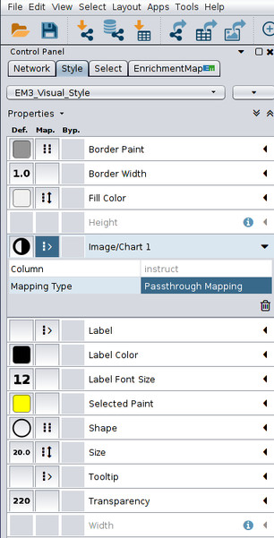
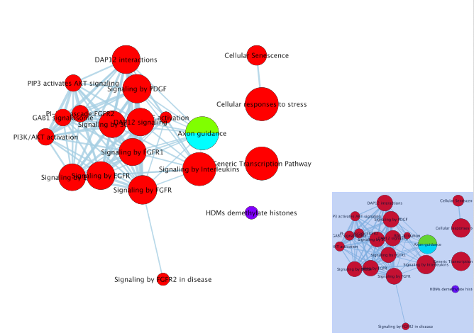

```{r, echo=FALSE}
knitr::opts_chunk$set(warning=FALSE, 
                      message=FALSE, 
                      width=500)
```

# Introduction 

This vignette will show how to create a pathway enrichment map using the results from `activeDriverPW`. In this example we will be using the results from the main activeDriverPW vignette. To follow along with this vignette, use any Cytoscape files written by `activeDriverPW` or follow the main activeDriverPW vignette, making sure to save the Cytoscape files in an accessible location.

# Required Files

Recall that `activeDriverPW` writes three files to be used in Cytoscape.
```{r}
files <- c(system.file('extdata', 'cytoscape_terms.txt', package='activeDriverPW'),
           system.file('extdata', 'cytoscape_groups.txt', package='activeDriverPW'),
           system.file('extdata', 'cytoscape_abridged.gmt', package='activeDriverPW'))
```
```{r, eval=FALSE}
# Not run. 
res <- activeDriverPW(dat, gmt, cytoscape.filenames=files)
```
The files written are:

* `cytoscape.filenames[1]`: a list of significant terms and the associated p-values. Note that only terms with `p.val <= significant` are written, even if you use the option `return.all=TRUE`.

* `cytoscape.filenames[2]`: a matrix indicating which columns the pathways are significant in. A 1 indicates that that pathway is significant if `activeDriverPW` is run on the data in just that one column. Note that this isn't the same as the column contribution. This file is skipped if you use the option `contribution=FALSE`.

* `cytoscape.filenames[3]`: a shortened version of the supplied GMT file which contains only the significant pathways. You don't need to use this file, but it helps speed up the process of creating the network inside Cytoscape.
```{r}
cat(paste(readLines(files[1])[1:5], collapse='\n'))
cat(paste(readLines(files[2])[1:5], collapse='\n'))
cat(paste(readLines(files[3])[1:2], collapse='\n'))
```

# Creating the enrichment map.
Open Cytoscape and ensure the *EnrichmentMap* and *enchancedGraphics* apps are installed. Apps may be installed by clicking *Apps -> App Manager* in Cytoscape. When the apps are installed, open the Apps menu again and click Enrichment Map. In the window that opens click the *Add Data Set from Files* button (The '+') in the top left, change the Analysis Type to Generic/gProfiler and upload the cytoscape_terms.txt and cytoscape_abridged.gmt files.


Click Build to create the network



(ps: to make network a little prettier you can increase the Edge Cutoff slider to reduce the number of edges, increase the scale (View > Show Tool Panel), and change the layout to organic (Layout > yFilesLayouts))

# Colour the nodes **change title**
To upload the groups table, go to file > import > table > file and import the cytoscape_groups.txt file

Click the style tab in the left panel and ensure the image/Chart1 property is available




Under the image/Chart 1 property, set the column on 'instruct' and the mapping type to passthrough



This colours the pathway nodes according to which columns the pathway is found to be enriched in if considering the data in only one column at a time. 



As of yet there is no functionality for automatically generating a legend, but it can be inferred from the cytoscape_groups.txt file. We can look at the first two lines of this file
```{r}
cat(paste(readLines(files[2])[1:2], collapse='\n'))
```
The `instruct` column contains the attributelist "X3UTR,X5UTR,CDS,promCore,none" and the colorlist "#FF0000FF,#80FF00FF,#00FFFFFF,#8000FFFF,#CCCCCC". This means that a node will be coloured #FF0000 (red) if it is enriched only in the X3UTR column, #FF0000 (red) and #80FF00 (green) if it is enriched in both the X3UTR and X5UTR columns, and so on. A pathway that is not enriched in any one column but is found to be significantly enriched when considering the data as a whole will be coloured #CCCCCC (grey)
